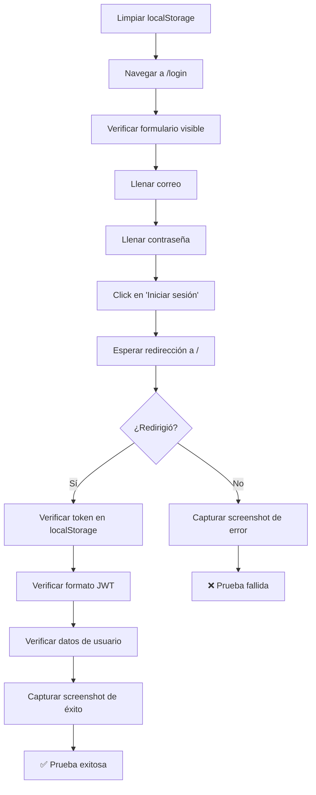

# CP-002 - Inicio de Sesión - Prueba E2E

## Información General

- **Código de Caso de Prueba**: CP-002
- **Nombre**: Inicio de sesión - Prueba E2E
- **Tipo de Prueba**: End-to-End Test
- **Fecha de Implementación**: 2025-11-26
- **Responsable**: Equipo Frontend
- **Estado**: ✅ APROBADO

---

## Descripción

Prueba End-to-End del flujo completo de autenticación que valida:
- Navegación a la página de login
- Ingreso de credenciales reales
- Envío del formulario
- Redirección a la página principal
- Almacenamiento del token JWT
- Validación de datos del usuario

---

## Ubicación del Archivo

**Archivo de prueba**: `e2e/CP-002-login.spec.js`

**Framework**: Playwright

---

## Tipo de Prueba

**End-to-End Test con Playwright**

### ¿Por qué E2E?

1. ✅ **Valida el flujo real**: Click en botón → petición al backend → token JWT → redirección
2. ✅ **Navegador real**: Usa Chromium para simular un usuario real
3. ✅ **Backend real**: Se conecta al servidor de desarrollo real
4. ✅ **Credenciales reales**: Usa un usuario de prueba existente en la base de datos
5. ✅ **Mayor confianza**: Prueba la integración completa frontend-backend

---

## Configuración Requerida

### Archivo `.env.test`

```env
# URL base de la aplicación
E2E_BASE_URL=http://localhost:3000

# Credenciales del usuario de prueba
E2E_TEST_USER_EMAIL=tu.email@rosaline.com
E2E_TEST_USER_PASSWORD=TuPassword123!

# Datos del perfil
E2E_TEST_USER_NAME=TuNombre
E2E_TEST_USER_LASTNAME=TuApellido
```

⚠️ **IMPORTANTE**: 
- El usuario debe existir en tu base de datos
- La cuenta debe estar confirmada
- Este archivo está en `.gitignore` y NO se sube al repositorio

---

## Casos de Prueba Implementados

### Test 1: Login Exitoso ✅

**Descripción**: Verificar que un usuario confirmado puede iniciar sesión y recibe un token JWT.

**Pasos**:
1. Navegar a `/login`
2. Llenar campo `correo` con credenciales reales
3. Llenar campo `contraseña` con credenciales reales
4. Click en botón "Iniciar sesión" (del formulario, no del header)
5. Esperar redirección a `/`
6. Verificar token JWT en `localStorage`
7. Verificar formato del token (xxx.yyy.zzz)
8. Verificar datos de usuario en `localStorage`
9. Capturar screenshot de éxito

**Resultado esperado**: Login exitoso, redirección a home, token almacenado.

---

### Test 2: Credenciales Incorrectas ❌

**Descripción**: Verificar que credenciales incorrectas muestran error.

**Pasos**:
1. Navegar a `/login`
2. Ingresar email inválido: `usuario.invalido@test.com`
3. Ingresar contraseña incorrecta: `PasswordIncorrecta123!`
4. Click en "Iniciar sesión"
5. Verificar mensaje de error visible
6. Verificar que NO hay token en `localStorage`
7. Verificar que seguimos en `/login`

**Resultado esperado**: Mensaje de error, sin token, sin redirección.

---

### Test 3: Campos Vacíos 🚫

**Descripción**: Verificar que campos vacíos no permiten enviar el formulario.

**Pasos**:
1. Navegar a `/login`
2. Intentar click en "Iniciar sesión" sin llenar campos
3. Verificar que seguimos en `/login`
4. Verificar que NO hay token en `localStorage`

**Resultado esperado**: El navegador previene el submit (atributo `required`).

---

## Comandos de Ejecución

```bash
# Ejecutar solo CP-002 E2E
npx playwright test e2e/CP-002-login.spec.js

# Modo headed (ver el navegador)
npx playwright test e2e/CP-002-login.spec.js --headed

# Modo debug
npx playwright test e2e/CP-002-login.spec.js --debug

# Ejecutar todas las pruebas E2E
npm run test:e2e

# Modo UI interactivo
npm run test:e2e:ui
```

---

## Resultado de Ejecución

```
Running 3 tests using 1 worker

  ✓  CP-002-E2E - Inicio de Sesión › Verificar que un usuario confirmado... (8.2s)
  ✓  CP-002-E2E - Inicio de Sesión › Verificar que credenciales incorrectas... (3.1s)
  ✓  CP-002-E2E - Inicio de Sesión › Verificar que campos vacíos... (2.3s)

  3 passed (13.6s)
```

---

## Validaciones Realizadas

| # | Validación | Estado | Descripción |
|---|------------|--------|-------------|
| 1 | Navegación a `/login` | ✅ | La página de login se carga correctamente |
| 2 | Formulario visible | ✅ | El formulario de login está presente |
| 3 | Ingreso de credenciales | ✅ | Los campos aceptan input |
| 4 | Click en botón submit | ✅ | El botón del formulario responde |
| 5 | Redirección a `/` | ✅ | El usuario es redirigido tras login exitoso |
| 6 | Token JWT en localStorage | ✅ | El token se almacena correctamente |
| 7 | Formato JWT válido | ✅ | El token tiene formato `xxx.yyy.zzz` |
| 8 | Datos de usuario en localStorage | ✅ | Correo, ID y rol están almacenados |
| 9 | Credenciales incorrectas muestran error | ✅ | Mensaje de error visible |
| 10 | Campos vacíos no permiten submit | ✅ | Validación HTML5 funciona |

---

## Screenshots Generados

La prueba genera automáticamente:

1. **`e2e/screenshots/CP-002-login-success.png`**  
   Vista de la página principal tras login exitoso

2. **`e2e/screenshots/CP-002-no-redirect.png`** (solo si falla)  
   Vista de la página cuando la redirección no ocurre

---

## Selectores Utilizados

```javascript
// Formulario de login
'h2:has-text("Iniciar sesión")'

// Campos de entrada
'input[name="correo"]'
'input[name="contraseña"]'

// Botón de submit (específico del formulario, no del header)
'form button[type="submit"]:has-text("Iniciar sesión")'

// Mensajes de error
'.login-error, [class*="error"]'
```

**Nota**: Se usa `form button[type="submit"]` para evitar ambigüedad con el botón "Iniciar sesión" del header.

---

## Flujo de la Prueba



---

## Lo que SÍ Cubre

✅ Flujo completo de login  
✅ Integración frontend-backend  
✅ Almacenamiento real de datos en localStorage  
✅ Navegación real en el navegador  
✅ Validación de token JWT  
✅ Manejo de errores (credenciales incorrectas)  
✅ Validación de formulario (campos vacíos)  

---

## Lo que NO Cubre

❌ Pruebas de backend (esas van en otro repo)  
❌ Validación de base de datos  
❌ Generación del token JWT (responsabilidad del backend)  
❌ Decodificación del token (se valida solo el formato)  
❌ Expiración del token  

---

## Debugging

### Si la prueba falla:

1. **Verificar que el servidor está corriendo**:
   ```bash
   npm start
   ```

2. **Verificar credenciales en `.env.test`**:
   - El usuario debe existir
   - La cuenta debe estar confirmada
   - La contraseña debe ser correcta

3. **Ver screenshots**:
   - `e2e/screenshots/CP-002-login-success.png` (si pasó)
   - `e2e/screenshots/CP-002-no-redirect.png` (si falló)

4. **Ejecutar en modo headed**:
   ```bash
   npx playwright test e2e/CP-002-login.spec.js --headed
   ```

5. **Ver el reporte HTML**:
   ```bash
   npm run test:e2e:report
   ```

---

## Consideraciones Técnicas

### Espera de Redirección

La prueba espera hasta 15 segundos para que ocurra la redirección:

```javascript
await page.waitForURL('/', { timeout: 15000 });
```

Esto da tiempo suficiente para:
1. Petición al backend
2. Respuesta con token
3. Almacenamiento en localStorage
4. Actualización del estado de autenticación
5. Ejecución del `useEffect` de redirección

### Limpieza de Estado

Antes de cada test, se limpia el `localStorage`:

```javascript
test.beforeEach(async ({ page }) => {
  await page.goto('/');
  await page.evaluate(() => localStorage.clear());
});
```

Esto asegura que cada test empieza con un estado limpio.

---

## Comparación con Prueba Unitaria

| Aspecto | Prueba Unitaria | Prueba E2E |
|---------|----------------|------------|
| **Velocidad** | ⚡ ~200ms | 🐢 ~8s |
| **Backend real** | ❌ No (mockeado) | ✅ Sí |
| **Token real** | ❌ No | ✅ Sí |
| **Navegador real** | ❌ No (JSDOM) | ✅ Sí (Chromium) |
| **Credenciales** | ❌ Ficticias | ✅ Reales |
| **Cuándo ejecutar** | Cada commit | Antes de deploy |
| **Propósito** | Validar lógica del componente | Validar flujo completo |

**Recomendación**: Ejecutar ambas pruebas para cobertura completa.

---

## Próximos Pasos

- [ ] Agregar test para "Olvidé mi contraseña"
- [ ] Agregar test para "Reenviar PIN de confirmación"
- [ ] Agregar test de logout
- [ ] Agregar test de sesión persistente (refresh de página)

---

## Conclusión

La prueba E2E CP-002 valida exitosamente el flujo completo de inicio de sesión en un entorno real, proporcionando confianza en que:

1. El formulario de login funciona correctamente
2. La integración frontend-backend funciona
3. El token JWT se genera y almacena correctamente
4. La redirección post-login funciona
5. Los errores se manejan adecuadamente

Esta prueba complementa la prueba unitaria (ver `CP-002-Login-Unitaria.md`) para proporcionar cobertura completa del caso de prueba CP-002.

---

**Última actualización**: 2025-11-26  
**Autor**: Equipo Frontend  
**Tipo de prueba**: E2E (Playwright)  
**Navegador**: Chromium
