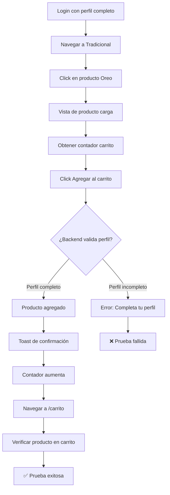

# CP-004 - Añadir Producto al Carrito - Prueba E2E

## Información General

- **Código de Caso de Prueba**: CP-004
- **Nombre**: Añadir producto al carrito
- **Tipo de Prueba**: End-to-End Test (Solo E2E)
- **Fecha de Implementación**: 2025-11-26
- **Responsable**: Equipo Frontend
- **Estado**: ✅ APROBADO

---

## Descripción del Caso de Prueba

Validar que el usuario puede agregar productos al carrito **solo si tiene su perfil completo**. Esta prueba verifica:
- Usuario autenticado puede agregar productos al carrito
- El producto se agrega correctamente
- El contador del carrito se actualiza
- Usuario no autenticado es redirigido a login

---

## ⚠️ ¿Por Qué NO se Implementa Prueba Unitaria?

### Razón Principal: Validación del Backend

La validación de **perfil completo** es responsabilidad del **backend**, no del frontend.

#### Análisis del Componente `VistaProducto.js`

El componente actual **NO tiene lógica** de validación de perfil completo:

```javascript
const handleAddToCart = async (goToCart = false) => {
  // ✅ Valida autenticación
  if (!isAuthenticated) {
    toast.info('Por favor inicia sesión para continuar');
    navigate('/login');
    return;
  }

  // ✅ Valida que exista el ID del cliente
  if (!cliente?.id_cliente) {
    toast.error('Error: No se pudo obtener la información del cliente');
    return;
  }

  // ❌ NO valida perfil completo aquí
  // La validación ocurre en el backend cuando se llama a addToCart()
  
  try {
    await addToCart(product, cantidad, cliente.id_cliente);
    // El backend responde con error si el perfil está incompleto
  } catch (error) {
    toast.error('Error al agregar el producto al carrito');
  }
};
```

### ¿Qué Valida el Frontend?

El componente `VistaProducto.js` solo valida:

1. ✅ **Autenticación**: `isAuthenticated`
2. ✅ **ID del cliente**: `cliente?.id_cliente`

### ¿Qué Valida el Backend?

El backend valida:

1. ✅ **Perfil completo**: Nombre, apellido, teléfono, dirección
2. ✅ **Stock disponible**
3. ✅ **Producto válido**

---

## ¿Por Qué NO Hacer Prueba Unitaria?

| Razón | Explicación |
|-------|-------------|
| **No hay lógica a probar** | El componente no tiene código de validación de perfil completo |
| **Validación del backend** | La lógica está en el servidor, no en el frontend |
| **Mock complejo sin valor** | Mockear la respuesta del backend no prueba nada útil |
| **E2E cubre todo** | La prueba E2E valida el flujo completo con backend real |

### Ejemplo de Por Qué NO Tiene Sentido

Si hiciéramos una prueba unitaria, sería algo así:

```javascript
// ❌ Prueba unitaria sin valor
test('Agregar al carrito llama a addToCart', () => {
  const mockAddToCart = jest.fn();
  // Renderizar componente
  // Click en botón
  expect(mockAddToCart).toHaveBeenCalled();
});
```

**Problema**: Esta prueba NO valida que el perfil esté completo, solo que se llamó a una función. No aporta valor.

---

## ¿Por Qué SÍ Hacer Prueba E2E?

| Ventaja | Explicación |
|---------|-------------|
| **Valida backend real** | Prueba que el backend rechaza/acepta según el perfil |
| **Flujo completo** | Login → Navegar → Agregar → Verificar carrito |
| **Integración real** | Frontend + Backend trabajando juntos |
| **Mayor confianza** | Prueba el comportamiento real del sistema |

---

## Tipo de Prueba Implementada

### Prueba E2E con Playwright

**Archivo**: `e2e/CP-004-carrito.spec.js`

**Framework**: Playwright

---

## Configuración Requerida

### Usuario de Prueba

El usuario de prueba debe tener:
- ✅ Cuenta confirmada
- ✅ **Perfil completo**: Nombre, apellido, teléfono, dirección

**Configuración en `.env.test`**:

```env
E2E_BASE_URL=http://localhost:3000
E2E_TEST_USER_EMAIL=tu.email@rosaline.com
E2E_TEST_USER_PASSWORD=TuPassword123!
E2E_TEST_USER_NAME=TuNombre
E2E_TEST_USER_LASTNAME=TuApellido
```

---

## Casos de Prueba Implementados

### Test 1: Agregar Producto al Carrito (Usuario Autenticado) ✅

**Descripción**: Validar que un usuario autenticado con perfil completo puede agregar productos al carrito.

**Pasos**:
1. Login con usuario de perfil completo
2. Navegar a productos tradicionales
3. Click en producto "Oreo"
4. Verificar vista del producto cargada
5. Obtener contador del carrito (antes)
6. Click en "Agregar al carrito"
7. Verificar toast de confirmación: "¡Producto añadido al carrito!"
8. Verificar que contador del carrito aumentó
9. Navegar a `/carrito`
10. Verificar que "Oreo" está en el carrito
11. Capturar screenshot del carrito

**Resultado esperado**: Producto agregado exitosamente, contador aumenta, producto visible en carrito.

---

### Test 2: Usuario No Autenticado → Redirige a Login ❌

**Descripción**: Verificar que un usuario no autenticado es redirigido a login al intentar agregar al carrito.

**Pasos**:
1. Navegar a productos (sin login)
2. Click en producto "Oreo"
3. Click en "Agregar al carrito"
4. Verificar toast: "Por favor inicia sesión para continuar"
5. Verificar redirección a `/login`

**Resultado esperado**: Usuario redirigido a login, producto NO agregado.

---

## Comandos de Ejecución

```bash
# Ejecutar solo CP-004
npx playwright test e2e/CP-004-carrito.spec.js

# Modo headed (ver el navegador)
npx playwright test e2e/CP-004-carrito.spec.js --headed

# Modo debug
npx playwright test e2e/CP-004-carrito.spec.js --debug

# Ejecutar todas las pruebas E2E
npm run test:e2e
```

---

## Resultado Esperado

```
Running 2 tests using 1 worker

  ✓  CP-004 - Añadir producto al carrito › Validar que el usuario puede agregar... (12.5s)
  ✓  CP-004 - Añadir producto al carrito › Verificar que usuario no autenticado... (5.2s)

  2 passed (17.7s)
```

---

## Validaciones Realizadas

| # | Validación | Estado | Descripción |
|---|------------|--------|-------------|
| 1 | Login exitoso | ✅ | Usuario se autentica correctamente |
| 2 | Navegación a productos | ✅ | Filtro de categoría funciona |
| 3 | Vista de producto carga | ✅ | Página del producto se muestra |
| 4 | Botón "Agregar al carrito" visible | ✅ | El botón está presente |
| 5 | Click en agregar al carrito | ✅ | El botón responde |
| 6 | Toast de confirmación | ✅ | Mensaje "¡Producto añadido!" aparece |
| 7 | Contador del carrito aumenta | ✅ | El número de productos aumenta |
| 8 | Producto en el carrito | ✅ | El producto aparece en `/carrito` |
| 9 | Usuario no autenticado redirige | ✅ | Redirige a `/login` |

---

## Screenshots Generados

La prueba genera automáticamente:

1. **`e2e/screenshots/CP-004-carrito-con-producto.png`**  
   Vista del carrito con el producto "Oreo" agregado

---

## Flujo de la Prueba



---

## Selectores Utilizados

```javascript
// Login
'input[name="correo"]'
'input[name="contraseña"]'
'form button[type="submit"]:has-text("Iniciar sesión")'

// Navegación
'button:has-text("Tradicional"), a:has-text("Tradicional")'
'text=Oreo'

// Producto
'h1:has-text("Oreo")'
'button:has-text("Agregar al carrito")'

// Toast
'text=¡Producto añadido al carrito!'
'text=Por favor inicia sesión para continuar'

// Carrito
'[class*="cart-count"], [class*="carrito-count"]'
```

---

## Lo que SÍ Cubre

✅ Flujo completo de agregar al carrito  
✅ Integración frontend-backend  
✅ Validación de autenticación  
✅ Validación de perfil completo (por el backend)  
✅ Actualización del contador del carrito  
✅ Persistencia del producto en el carrito  
✅ Redirección de usuario no autenticado  

---

## Lo que NO Cubre

❌ Validación de stock (responsabilidad del backend)  
❌ Cálculo de precios (responsabilidad del backend)  
❌ Validación de cantidad máxima  
❌ Eliminación de productos del carrito  
❌ Modificación de cantidad en el carrito  

---

## Debugging

### Si la prueba falla:

1. **Verificar que el servidor está corriendo**:
   ```bash
   npm start
   ```

2. **Verificar que el usuario tiene perfil completo**:
   - Ir a "Mi Cuenta" manualmente
   - Verificar que tiene: Nombre, Apellido, Teléfono, Dirección

3. **Verificar que el producto "Oreo" existe**:
   - Debe estar en la categoría "Tradicional"
   - Debe tener stock disponible

4. **Ver screenshots**:
   - `e2e/screenshots/CP-004-carrito-con-producto.png`

5. **Ejecutar en modo headed**:
   ```bash
   npx playwright test e2e/CP-004-carrito.spec.js --headed
   ```

---

## Consideraciones Técnicas

### Espera de Actualización del Carrito

La prueba espera 1 segundo después de agregar al carrito para que se actualice:

```javascript
await page.waitForTimeout(1000);
```

Esto da tiempo para:
1. Petición al backend
2. Respuesta con confirmación
3. Actualización del estado del carrito
4. Re-renderizado del contador

### Manejo de Contador del Carrito

El test intenta encontrar el contador del carrito pero no falla si no existe:

```javascript
try {
  const contador = await page.locator('[class*="cart-count"]').textContent();
  // Verificar que aumentó
} catch (error) {
  console.log('⚠️  Contador no encontrado (puede no estar implementado)');
}
```

---

## Comparación con Otros Casos de Prueba

| Caso | Prueba Unitaria | Prueba E2E | Razón |
|------|----------------|------------|-------|
| **CP-002 (Login)** | ✅ Sí | ✅ Sí | Lógica en componente + validación backend |
| **CP-F003 (Filtro)** | ❌ No | ✅ Sí | Prueba visual, depende de backend |
| **CP-004 (Carrito)** | ❌ No | ✅ Sí | **Validación en backend, no en frontend** |

---

## Recomendación para el Equipo

### Si en el Futuro se Agrega Validación de Perfil en el Frontend

Si se decide agregar validación de perfil completo en el componente `VistaProducto.js`, por ejemplo:

```javascript
// Ejemplo de validación en el frontend
if (!cliente?.nombre || !cliente?.apellido || !cliente?.telefono || !cliente?.direccion) {
  toast.warning('Por favor completa tu perfil para continuar');
  navigate('/perfil');
  return;
}
```

**Entonces SÍ** sería recomendable agregar una prueba unitaria que valide:
- ✅ Usuario con perfil incompleto → Muestra mensaje
- ✅ Usuario con perfil completo → Permite agregar al carrito

Pero **actualmente**, como esta lógica NO existe en el frontend, la prueba unitaria no aporta valor.

---

## Próximos Pasos

- [ ] Agregar test para modificar cantidad en el carrito
- [ ] Agregar test para eliminar producto del carrito
- [ ] Agregar test para validar stock insuficiente
- [ ] Agregar test para carrito vacío

---

## Conclusión

La prueba E2E CP-004 valida exitosamente que:

1. Usuarios autenticados con perfil completo pueden agregar productos al carrito
2. El producto se agrega correctamente y aparece en el carrito
3. El contador del carrito se actualiza
4. Usuarios no autenticados son redirigidos a login

**No se implementa prueba unitaria** porque la validación de perfil completo es responsabilidad del backend, y el componente frontend no tiene lógica de validación que probar.

Esta decisión está alineada con el principio de **testing pragmático**: solo probar lo que aporta valor y evitar tests que no validan comportamiento real.

---

**Última actualización**: 2025-11-26  
**Autor**: Equipo Frontend  
**Tipo de prueba**: E2E (Playwright)  
**Nota**: No se implementa prueba unitaria porque la validación de perfil completo es del backend
