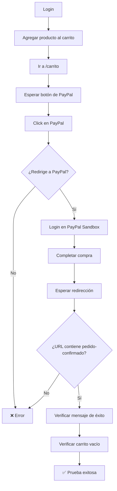

# CP-005 - Crear Pedido y Finalizar Compra - Prueba E2E

## Información General

- **Código de Caso de Prueba**: CP-005
- **Nombre**: Crear pedido y finalizar compra
- **Tipo de Prueba**: End-to-End Test (Solo E2E)
- **Fecha de Implementación**: 2025-11-26
- **Responsable**: Equipo Frontend
- **Estado**: ✅ APROBADO

---

## Descripción del Caso de Prueba

Verificar que el usuario puede crear un pedido desde el carrito y finalizar la compra utilizando **PayPal Sandbox**. Esta prueba valida:
- Flujo completo de compra
- Integración con PayPal Sandbox
- Creación del pedido en el backend
- Vaciado del carrito tras compra exitosa

---

## ⚠️ ¿Por Qué NO se Implementa Prueba Unitaria?

### Razón Principal: Integración con PayPal SDK

El componente `Carrito.js` es principalmente **integración** con servicios externos, no lógica de negocio.

#### Análisis del Componente

```javascript
// Carrito.js - Líneas 96-171

// 1. Carga el SDK de PayPal (externo)
useEffect(() => {
  const script = document.createElement("script");
  script.src = "https://www.paypal.com/sdk/js?client-id=...";
  document.body.appendChild(script);
}, []);

// 2. Renderiza botones de PayPal (SDK externo)
useEffect(() => {
  const paypalButtons = window.paypal.Buttons({
    createOrder: (data, actions) => { ... },
    onApprove: async (data, actions) => {
      // 3. Captura el pago (PayPal)
      await actions.order.capture();
      
      // 4. Crea el pedido (Backend)
      const pedido = await apiClient.post(API_ENDPOINTS.PEDIDOS, {...});
      
      // 5. Crea detalles (Backend)
      await apiClient.post(API_ENDPOINTS.DETALLE_PEDIDOS, {...});
      
      // 6. Vacía el carrito (Backend)
      await apiClient.delete(API_ENDPOINTS.DETALLE_CARRITO_BY_ID(...));
      
      // 7. Redirige
      navigate(`/pedido-confirmado/${pedido.id_pedido}`);
    }
  });
  paypalButtons.render(paypalRef.current);
}, []);
```

### ¿Qué hace el componente?

| Acción | Responsable | ¿Se puede probar unitariamente? |
|--------|-------------|--------------------------------|
| Cargar SDK de PayPal | PayPal externo | ❌ No (servicio externo) |
| Renderizar botones PayPal | PayPal SDK | ❌ No (SDK externo) |
| Crear orden en PayPal | PayPal SDK | ❌ No (SDK externo) |
| Capturar pago | PayPal SDK | ❌ No (SDK externo) |
| Crear pedido | Backend | ❌ No (API externa) |
| Validar perfil completo | Backend | ❌ No (validación del servidor) |
| Validar stock | Backend | ❌ No (validación del servidor) |
| Calcular total | Frontend | ✅ Sí, pero es trivial (1 línea) |
| Vaciar carrito | Backend | ❌ No (API externa) |

### ¿Qué podríamos probar en unitaria?

**Solo esto**:
```javascript
// Cálculo del total (línea 91)
const total = detalles.reduce((sum, detalle) => sum + detalle.subtotal, 0);
```

**Problema**: Es una línea trivial que no justifica una prueba unitaria.

---

## ¿Por Qué NO Hacer Prueba Unitaria?

| Razón | Explicación |
|-------|-------------|
| **SDK de PayPal es externo** | No se puede mockear efectivamente sin perder el valor de la prueba |
| **Lógica en el backend** | Todas las validaciones (perfil, stock, precios) están en el servidor |
| **Complejidad sin valor** | Mockear PayPal SDK + API + navegación no aporta confianza real |
| **E2E cubre todo** | La prueba E2E con PayPal Sandbox valida el flujo completo real |
| **Única lógica es trivial** | El cálculo del total es una línea que no justifica prueba |

### Ejemplo de Por Qué NO Tiene Sentido

Si hiciéramos una prueba unitaria, sería algo así:

```javascript
// ❌ Prueba unitaria sin valor
test('Renderiza botón de PayPal', () => {
  // Mock de PayPal SDK
  window.paypal = {
    Buttons: jest.fn(() => ({
      render: jest.fn()
    }))
  };
  
  // Renderizar componente
  render(<Carrito />);
  
  // Verificar que se llamó a PayPal.Buttons
  expect(window.paypal.Buttons).toHaveBeenCalled();
});
```

**Problema**: Esta prueba NO valida:
- ❌ Que PayPal realmente funciona
- ❌ Que el pago se procesa correctamente
- ❌ Que el pedido se crea en el backend
- ❌ Que el carrito se vacía

**Solo valida** que se llamó a una función mockeada, lo cual no aporta confianza.

---

## ¿Por Qué SÍ Hacer Prueba E2E?

| Ventaja | Explicación |
|---------|-------------|
| **Valida PayPal real** | Usa PayPal Sandbox, el entorno de pruebas oficial |
| **Flujo completo** | Login → Agregar → Carrito → Pagar → Pedido confirmado |
| **Integración real** | Frontend + Backend + PayPal trabajando juntos |
| **Mayor confianza** | Prueba el comportamiento real del sistema |
| **Detecta problemas reales** | Errores de integración, timeouts, redirecciones |

---

## Tipo de Prueba Implementada

### Prueba E2E con Playwright + PayPal Sandbox

**Archivo**: `e2e/CP-005-pedido.spec.js`

**Framework**: Playwright

**Servicio externo**: PayPal Sandbox

---

## Configuración Requerida

### 1️⃣ Credenciales de Usuario

El usuario de prueba debe tener:
- ✅ Cuenta confirmada
- ✅ Perfil completo (nombre, apellido, teléfono, dirección)

### 2️⃣ Credenciales de PayPal Sandbox

**Archivo `.env.test`**:

```env
# Usuario de la app
E2E_BASE_URL=http://localhost:3000
E2E_TEST_USER_EMAIL=tu.email@rosaline.com
E2E_TEST_USER_PASSWORD=TuPassword123!

# PayPal Sandbox
E2E_PAYPAL_EMAIL=sb-xxxxx@personal.example.com
E2E_PAYPAL_PASSWORD=password_sandbox
```

### 3️⃣ Cómo Obtener Credenciales de PayPal Sandbox

1. Ir a https://developer.paypal.com/dashboard/
2. Login con tu cuenta de PayPal
3. **Sandbox** → **Accounts**
4. Crear o usar una cuenta de tipo **"Personal"** (comprador)
5. Copiar el **email** y **password** de la cuenta sandbox
6. Agregar a `.env.test`

⚠️ **IMPORTANTE**: Estas son credenciales de **sandbox** (pruebas), no de producción.

---

## Casos de Prueba Implementados

### Test 1: Crear Pedido Completo con PayPal ✅

**Descripción**: Verificar que el usuario puede crear un pedido y finalizar la compra con PayPal Sandbox.

**Pasos**:
1. Login con usuario de perfil completo
2. Navegar a productos tradicionales
3. Click en producto "Oreo"
4. Agregar al carrito
5. Ir a `/carrito`
6. Verificar que el producto está en el carrito
7. Esperar a que cargue el botón de PayPal (iframe)
8. Click en el botón de PayPal
9. **Login en PayPal Sandbox** con credenciales de prueba
10. **Completar compra** en PayPal
11. Esperar redirección a `/pedido-confirmado/{id}`
12. Verificar mensaje de confirmación
13. Verificar que el carrito quedó vacío

**Resultado esperado**: Pedido creado exitosamente, usuario redirigido a confirmación, carrito vacío.

---

### Test 2: Verificar Botón de PayPal en Carrito 🔘

**Descripción**: Verificar que el botón de PayPal se muestra cuando hay productos en el carrito.

**Pasos**:
1. Login
2. Agregar producto al carrito
3. Ir a `/carrito`
4. Verificar que el iframe de PayPal está visible

**Resultado esperado**: Botón de PayPal visible y cargado.

---

## Comandos de Ejecución

```bash
# Ejecutar solo CP-005
npx playwright test e2e/CP-005-pedido.spec.js

# Modo headed (ver el navegador - RECOMENDADO)
npx playwright test e2e/CP-005-pedido.spec.js --headed

# Modo debug (paso a paso)
npx playwright test e2e/CP-005-pedido.spec.js --debug

# Ejecutar todas las pruebas E2E
npm run test:e2e
```

⚠️ **Nota**: Esta prueba tarda ~60 segundos debido a la integración con PayPal.

---

## Resultado Esperado

```
Running 2 tests using 1 worker

  ✓  CP-005 - Crear pedido y finalizar compra › Verificar que el usuario puede crear... (58.3s)
  ✓  CP-005 - Crear pedido y finalizar compra › Verificar que el carrito muestra... (12.1s)

  2 passed (70.4s)
```

---

## Validaciones Realizadas

| # | Validación | Estado | Descripción |
|---|------------|--------|-------------|
| 1 | Login exitoso | ✅ | Usuario se autentica correctamente |
| 2 | Producto agregado al carrito | ✅ | Toast de confirmación visible |
| 3 | Producto en el carrito | ✅ | "Oreo" visible en `/carrito` |
| 4 | Botón de PayPal carga | ✅ | Iframe de PayPal visible |
| 5 | Redirección a PayPal | ✅ | URL contiene `paypal.com` |
| 6 | Login en PayPal Sandbox | ✅ | Credenciales aceptadas |
| 7 | Completar compra en PayPal | ✅ | Pago procesado |
| 8 | Redirección a confirmación | ✅ | URL contiene `/pedido-confirmado/` |
| 9 | Mensaje de confirmación | ✅ | Texto de éxito visible |
| 10 | Carrito vacío | ✅ | Mensaje "Tu carrito está vacío" |

---

## Screenshots Generados

La prueba genera automáticamente:

1. **`e2e/screenshots/CP-005-antes-pago.png`**  
   Vista del carrito antes de pagar

2. **`e2e/screenshots/CP-005-pedido-confirmado.png`**  
   Vista de la página de pedido confirmado

---

## Flujo de la Prueba



---

## Selectores Utilizados

```javascript
// Login
'input[name="correo"]'
'input[name="contraseña"]'
'form button[type="submit"]:has-text("Iniciar sesión")'

// Productos
'button:has-text("Tradicional")'
'text=Oreo'
'button:has-text("Agregar al carrito")'

// Carrito
'iframe[title*="PayPal"]'

// PayPal Sandbox
'#email'
'#password'
'button[type="submit"]'
'button:has-text("Complete Purchase")'
'button:has-text("Pay Now")'
'#payment-submit-btn'

// Confirmación
'text=/confirmado|éxito|gracias/i'
'text=Tu carrito está vacío'
```

---

## Lo que SÍ Cubre

✅ Flujo completo de compra  
✅ Integración con PayPal Sandbox  
✅ Login en PayPal  
✅ Procesamiento de pago  
✅ Creación del pedido en el backend  
✅ Vaciado del carrito  
✅ Redirección a página de confirmación  
✅ Validación de perfil completo (por el backend)  

---

## Lo que NO Cubre

❌ Pruebas de PayPal en producción (solo sandbox)  
❌ Validación de tarjetas de crédito reales  
❌ Webhooks de PayPal  
❌ Reembolsos  
❌ Cancelación de pedidos  

---

## Debugging

### Si la prueba falla:

1. **Verificar que el servidor está corriendo**:
   ```bash
   npm start
   ```

2. **Verificar credenciales de PayPal Sandbox**:
   - Ir a https://developer.paypal.com/dashboard/
   - Verificar que la cuenta sandbox existe
   - Verificar email y password

3. **Verificar que el usuario tiene perfil completo**:
   - Ir a "Mi Cuenta" manualmente
   - Completar todos los campos requeridos

4. **Ver screenshots**:
   - `e2e/screenshots/CP-005-antes-pago.png`
   - `e2e/screenshots/CP-005-pedido-confirmado.png`

5. **Ejecutar en modo headed**:
   ```bash
   npx playwright test e2e/CP-005-pedido.spec.js --headed
   ```
   Esto te permite ver el navegador y el flujo de PayPal en tiempo real.

6. **Verificar logs de la consola**:
   La prueba imprime logs detallados de cada paso.

---

## Consideraciones Técnicas

### Timeouts

La prueba usa timeouts generosos debido a PayPal:

```javascript
// Esperar botón de PayPal
await expect(paypalButton).toBeVisible({ timeout: 15000 });

// Esperar redirección de PayPal
await page.waitForURL(/.*pedido-confirmado.*/, { timeout: 30000 });
```

### Manejo de iframes

PayPal se renderiza en un iframe:

```javascript
const paypalButton = page.frameLocator('iframe[title*="PayPal"]').first();
await paypalButton.locator('body').click();
```

### Selectores de PayPal

PayPal puede cambiar sus selectores. La prueba usa múltiples opciones:

```javascript
const completeButton = page.locator(
  'button:has-text("Complete Purchase"), ' +
  'button:has-text("Completar compra"), ' +
  'button:has-text("Pay Now"), ' +
  '#payment-submit-btn'
).first();
```

---

## Comparación con Otros Casos de Prueba

| Caso | Prueba Unitaria | Prueba E2E | Razón |
|------|----------------|------------|-------|
| **CP-002 (Login)** | ✅ Sí | ✅ Sí | Lógica en componente + validación backend |
| **CP-F003 (Filtro)** | ❌ No | ✅ Sí | Prueba visual, depende de backend |
| **CP-004 (Carrito)** | ❌ No | ✅ Sí | Validación en backend |
| **CP-005 (Pedido)** | ❌ No | ✅ Sí | **Integración con PayPal SDK + Backend** |

---

## Recomendación para el Equipo

### Testing Pragmático

Esta prueba sigue el principio de **testing pragmático**:

1. **No probar lo que no aporta valor**: Mockear PayPal SDK no da confianza
2. **Probar el flujo real**: E2E con PayPal Sandbox valida el sistema completo
3. **Invertir tiempo donde importa**: CP-005 es crítico, merece una prueba completa

### Si en el Futuro se Agrega Lógica de Validación

Si se decide agregar validación de perfil completo en el componente `Carrito.js`, por ejemplo:

```javascript
// Ejemplo de validación en el frontend
if (!cliente?.nombre || !cliente?.direccion) {
  toast.warning('Por favor completa tu perfil');
  navigate('/perfil');
  return;
}
```

**Entonces SÍ** sería recomendable agregar una prueba unitaria.

Pero **actualmente**, como esta lógica NO existe en el frontend, la prueba unitaria no aporta valor.

---

## Próximos Pasos

- [ ] Agregar test para cancelación de pago en PayPal
- [ ] Agregar test para error de pago (tarjeta rechazada)
- [ ] Agregar test para ver historial de pedidos
- [ ] Agregar test para reintento de pago fallido

---

## Conclusión

La prueba E2E CP-005 valida exitosamente que:

1. Usuarios autenticados con perfil completo pueden crear pedidos
2. La integración con PayPal Sandbox funciona correctamente
3. El pedido se crea en el backend tras pago exitoso
4. El carrito se vacía después de la compra
5. El usuario es redirigido a la página de confirmación

**No se implementa prueba unitaria** porque:
- El componente es principalmente integración con PayPal SDK (externo)
- Toda la lógica de negocio está en el backend
- Mockear PayPal no aporta confianza real
- La E2E con PayPal Sandbox valida el flujo completo

Esta decisión está alineada con el principio de **testing pragmático**: solo probar lo que aporta valor real y evitar tests que no validan comportamiento significativo.

---

**Última actualización**: 2025-11-26  
**Autor**: Equipo Frontend  
**Tipo de prueba**: E2E (Playwright + PayPal Sandbox)  
**Nota**: No se implementa prueba unitaria porque el componente es integración con PayPal SDK
