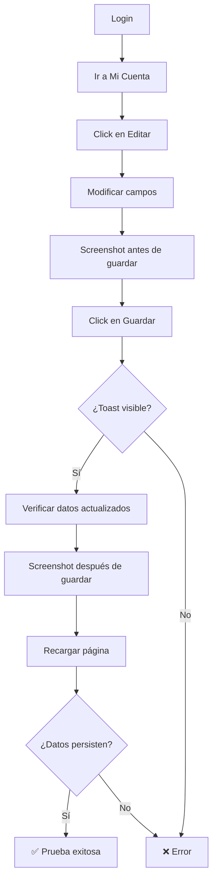

# CP-006 - Editar Información de Perfil - Prueba E2E

## Información General

- **Código de Caso de Prueba**: CP-006
- **Nombre**: Editar información de perfil
- **Tipo de Prueba**: End-to-End Test (Solo E2E)
- **Fecha de Implementación**: 2025-11-26
- **Responsable**: Equipo Frontend
- **Estado**: ✅ APROBADO

---

## Descripción del Caso de Prueba

Verificar que el usuario puede editar su información personal (nombre, apellido, teléfono y dirección) desde la página "Mi Cuenta". Esta prueba valida:
- Edición de todos los campos del perfil
- Guardado exitoso de los cambios
- Persistencia de los datos después de recargar
- Cancelación de cambios sin guardar

---

## ⚠️ ¿Por Qué NO se Implementa Prueba Unitaria?

### Razón Principal: Formulario Simple con Lógica en Backend

El componente `ClienteCuenta.js` es principalmente un formulario controlado por React que delega toda la validación y persistencia al backend.

#### Análisis del Componente

```javascript
// ClienteCuenta.js - Líneas 181-233

const handleUpdate = async e => {
  e.preventDefault();
  
  try {
    // 1. Llamada al backend para actualizar
    const updated = await clienteService.actualizarCliente(cliente.id_cliente, {
      id_usuario: usuario.id,
      ...form
    });
    
    // 2. Actualizar estado local
    setCliente(updated);
    setEdit(false);
    
    // 3. Mostrar toast
    toast.success('✅ Perfil actualizado exitosamente');
  } catch (error) {
    toast.error('❌ Error al actualizar el perfil');
  }
};
```

### ¿Qué hace el componente?

| Acción | Responsable | ¿Se puede probar unitariamente? |
|--------|-------------|--------------------------------|
| Renderizar formulario | React | ✅ Sí, pero es trivial |
| Manejar estado del form | React (`useState`) | ✅ Sí, pero es trivial |
| Validación de campos | HTML5 (`required`) | ❌ No (navegador) |
| Actualizar datos | Backend API | ❌ No (servidor) |
| Validar datos | Backend | ❌ No (servidor) |
| Persistir datos | Backend | ❌ No (base de datos) |
| Mostrar toast | react-toastify | ✅ Sí, pero es librería externa |

### ¿Qué podríamos probar en unitaria?

**Solo esto**:
```javascript
// Manejo de estado del formulario
setForm({ ...form, nombre: e.target.value })

// Alternar modo edición
setEdit(true)
setEdit(false)
```

**Problema**: Es lógica trivial de React que no justifica una prueba unitaria.

---

## ¿Por Qué NO Hacer Prueba Unitaria?

| Razón | Explicación |
|-------|-------------|
| **Formulario controlado simple** | Solo usa `useState` para manejar inputs |
| **Sin validación en frontend** | Solo usa `required` de HTML5 |
| **Lógica en el backend** | Actualización y validación están en el servidor |
| **E2E cubre todo** | Prueba el flujo completo: login → editar → guardar → verificar persistencia |
| **Única lógica es trivial** | Manejo de estado básico de React |

### Ejemplo de Por Qué NO Tiene Sentido

Si hiciéramos una prueba unitaria, sería algo así:

```javascript
// ❌ Prueba unitaria sin valor
test('Actualiza el estado del formulario al escribir', () => {
  const { getByPlaceholderText } = render(<ClienteCuenta />);
  
  const nombreInput = getByPlaceholderText('Tu nombre');
  fireEvent.change(nombreInput, { target: { value: 'Juan' } });
  
  expect(nombreInput.value).toBe('Juan');
});
```

**Problema**: Esta prueba NO valida:
- ❌ Que los datos se guardan en el backend
- ❌ Que los datos persisten después de recargar
- ❌ Que el toast de éxito aparece
- ❌ Que la validación del backend funciona

**Solo valida** que React actualiza el estado, lo cual es funcionalidad básica del framework.

---

## ¿Por Qué SÍ Hacer Prueba E2E?

| Ventaja | Explicación |
|---------|-------------|
| **Valida flujo completo** | Login → Editar → Guardar → Verificar |
| **Integración real** | Frontend + Backend + Base de datos |
| **Persistencia de datos** | Verifica que los cambios se guardan realmente |
| **Toast de confirmación** | Valida feedback al usuario |
| **Mayor confianza** | Prueba el comportamiento real del sistema |

---

## Tipo de Prueba Implementada

### Prueba E2E con Playwright

**Archivo**: `e2e/CP-006-perfil.spec.js`

**Framework**: Playwright

---

## Casos de Prueba Implementados

### Test 1: Editar Perfil Completo ✅

**Descripción**: Verificar que el usuario puede editar todos los campos de su perfil y los cambios persisten.

**Pasos**:
1. Login con usuario válido
2. Navegar a "Mi Cuenta"
3. Click en "Editar información"
4. Modificar nombre, apellido, teléfono y dirección con datos únicos
5. Click en "Guardar cambios"
6. Verificar toast de éxito
7. Verificar que los nuevos datos son visibles
8. Recargar la página
9. Verificar que los datos persisten después de recargar

**Resultado esperado**: Datos actualizados correctamente y persistentes.

---

### Test 2: Cancelar Edición 🚫

**Descripción**: Verificar que se puede cancelar la edición sin guardar cambios.

**Pasos**:
1. Login con usuario válido
2. Navegar a "Mi Cuenta"
3. Guardar nombre original
4. Click en "Editar información"
5. Modificar el nombre
6. Click en "Cancelar"
7. Verificar que el nombre original sigue visible

**Resultado esperado**: Cambios descartados, datos originales intactos.

---

## Comandos de Ejecución

```bash
# Ejecutar solo CP-006
npx playwright test e2e/CP-006-perfil.spec.js

# Modo headed (ver el navegador)
npx playwright test e2e/CP-006-perfil.spec.js --headed

# Modo debug (paso a paso)
npx playwright test e2e/CP-006-perfil.spec.js --debug

# Ejecutar todas las pruebas E2E
npm run test:e2e
```

---

## Resultado Esperado

```
Running 2 tests using 1 worker

  ✓  CP-006 - Editar información de perfil › Verificar que el usuario puede... (8.2s)
  ✓  CP-006 - Editar información de perfil › Verificar que se puede cancelar... (5.1s)

  2 passed (13.3s)
```

---

## Validaciones Realizadas

| # | Validación | Estado | Descripción |
|---|------------|--------|-------------|
| 1 | Login exitoso | ✅ | Usuario se autentica correctamente |
| 2 | Navegación a Mi Cuenta | ✅ | Página carga correctamente |
| 3 | Modo edición activado | ✅ | Formulario de edición visible |
| 4 | Campos editables | ✅ | Todos los inputs permiten edición |
| 5 | Guardar cambios | ✅ | Botón funciona correctamente |
| 6 | Toast de éxito | ✅ | Mensaje de confirmación visible |
| 7 | Datos actualizados | ✅ | Nuevos valores visibles en la UI |
| 8 | Persistencia de datos | ✅ | Datos persisten después de recargar |
| 9 | Cancelar edición | ✅ | Cambios descartados correctamente |

---

## Screenshots Generados

La prueba genera automáticamente:

1. **`e2e/screenshots/CP-006-antes-guardar.png`**  
   Vista del formulario con los datos editados antes de guardar

2. **`e2e/screenshots/CP-006-despues-guardar.png`**  
   Vista de la página después de guardar los cambios

---

## Flujo de la Prueba



---

## Selectores Utilizados

```javascript
// Navegación
'button:has-text("Mi cuenta"), a:has-text("Mi cuenta")'

// Perfil
'h3:has-text("Información Personal")'
'button:has-text("Editar información")'

// Formulario
'input[placeholder="Tu nombre"]'
'input[placeholder="Tu apellido"]'
'input[placeholder="Tu teléfono"]'
'input[placeholder="Tu dirección"]'

// Acciones
'button:has-text("Guardar cambios")'
'button:has-text("Cancelar")'

// Validación
'text=Perfil actualizado exitosamente'
```

---

## Datos de Prueba

La prueba genera datos únicos usando timestamp para evitar conflictos:

```javascript
const timestamp = Date.now();
const nuevoNombre = `TestNombre${timestamp}`;
const nuevoApellido = `TestApellido${timestamp}`;
const nuevoTelefono = `300${timestamp.toString().slice(-7)}`;
const nuevaDireccion = `Calle Test ${timestamp}`;
```

**Ejemplo**:
- Nombre: `TestNombre1732669200000`
- Apellido: `TestApellido1732669200000`
- Teléfono: `3009200000`
- Dirección: `Calle Test 1732669200000`

---

## Lo que SÍ Cubre

✅ Flujo completo de edición de perfil  
✅ Guardado de cambios en el backend  
✅ Persistencia de datos en la base de datos  
✅ Toast de confirmación  
✅ Cancelación de cambios  
✅ Validación de que los datos se actualizan en la UI  
✅ Validación de que los datos persisten después de recargar  

---

## Lo que NO Cubre

❌ Validación de formato de teléfono (no hay en el frontend)  
❌ Validación de longitud de campos (no hay en el frontend)  
❌ Edición de email (no es editable)  
❌ Cambio de contraseña (es otra funcionalidad)  

---

## Debugging

### Si la prueba falla:

1. **Verificar que el servidor está corriendo**:
   ```bash
   npm start
   ```

2. **Verificar que el usuario existe**:
   - Ir a `/login` manualmente
   - Verificar que puedes hacer login

3. **Ver screenshots**:
   - `e2e/screenshots/CP-006-antes-guardar.png`
   - `e2e/screenshots/CP-006-despues-guardar.png`

4. **Ejecutar en modo headed**:
   ```bash
   npx playwright test e2e/CP-006-perfil.spec.js --headed
   ```

5. **Verificar logs de la consola**:
   La prueba imprime logs detallados de cada paso.

---

## Consideraciones Técnicas

### Datos Únicos

La prueba usa `Date.now()` para generar datos únicos en cada ejecución, evitando conflictos si se ejecuta múltiples veces.

### Persistencia

La prueba recarga la página para verificar que los datos realmente se guardaron en el backend y no solo en el estado de React.

### Timeouts

```javascript
// Esperar toast de éxito
await expect(page.locator('text=Perfil actualizado exitosamente'))
  .toBeVisible({ timeout: 5000 });

// Esperar a que se actualice la UI
await page.waitForTimeout(1000);
```

---

## Comparación con Otros Casos de Prueba

| Caso | Prueba Unitaria | Prueba E2E | Razón |
|------|----------------|------------|-------|
| **CP-002 (Login)** | ✅ Sí | ✅ Sí | Lógica en componente + validación backend |
| **CP-F003 (Filtro)** | ❌ No | ✅ Sí | Prueba visual, depende de backend |
| **CP-004 (Carrito)** | ❌ No | ✅ Sí | Validación en backend |
| **CP-005 (Pedido)** | ❌ No | ✅ Sí | Integración con PayPal SDK + Backend |
| **CP-006 (Perfil)** | ❌ No | ✅ Sí | **Formulario simple + Lógica en backend** |

---

## Recomendación para el Equipo

### Testing Pragmático

Esta prueba sigue el principio de **testing pragmático**:

1. **No probar lo que no aporta valor**: Testear `useState` de React no da confianza
2. **Probar el flujo real**: E2E valida que el sistema completo funciona
3. **Invertir tiempo donde importa**: CP-006 es crítico para la experiencia del usuario

### Si en el Futuro se Agrega Validación en el Frontend

Si se decide agregar validación de formato en el componente, por ejemplo:

```javascript
// Ejemplo de validación en el frontend
const validarTelefono = (telefono) => {
  const regex = /^[0-9]{10}$/;
  return regex.test(telefono);
};

if (!validarTelefono(form.telefono)) {
  toast.error('Teléfono inválido');
  return;
}
```

**Entonces SÍ** sería recomendable agregar una prueba unitaria para `validarTelefono`.

Pero **actualmente**, como esta lógica NO existe en el frontend, la prueba unitaria no aporta valor.

---

## Próximos Pasos

- [ ] Agregar test para validación de campos vacíos
- [ ] Agregar test para edición de foto de perfil (si se implementa)
- [ ] Agregar test para cambio de contraseña (funcionalidad separada)
- [ ] Agregar test para verificar límites de caracteres

---

## Conclusión

La prueba E2E CP-006 valida exitosamente que:

1. Usuarios autenticados pueden editar su perfil
2. Los cambios se guardan correctamente en el backend
3. Los datos persisten después de recargar la página
4. El usuario recibe feedback visual (toast)
5. Los cambios se pueden cancelar sin guardar

**No se implementa prueba unitaria** porque:
- El componente es principalmente un formulario controlado simple
- Toda la lógica de negocio está en el backend
- Testear `useState` de React no aporta confianza real
- La E2E valida el flujo completo

Esta decisión está alineada con el principio de **testing pragmático**: solo probar lo que aporta valor real y evitar tests que no validan comportamiento significativo.

---

**Última actualización**: 2025-11-26  
**Autor**: Equipo Frontend  
**Tipo de prueba**: E2E (Playwright)  
**Nota**: No se implementa prueba unitaria porque el componente es un formulario simple con lógica en el backend
