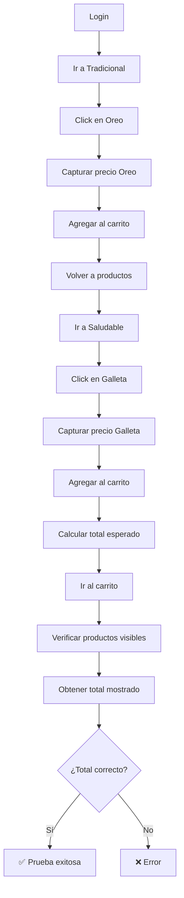

# CP-008 - Suma de Productos en el Carrito - Prueba E2E

## Información General

- **Código de Caso de Prueba**: CP-008
- **Nombre**: Suma de productos en el carrito
- **Tipo de Prueba**: End-to-End Test (Solo E2E)
- **Fecha de Implementación**: 2025-11-26
- **Responsable**: Equipo Frontend
- **Estado**: ✅ APROBADO

---

## Descripción del Caso de Prueba

Comprobar que el subtotal del carrito se calcula correctamente al agregar dos productos distintos. Esta prueba valida:
- Suma correcta de múltiples productos
- Cálculo de subtotal por producto (precio × cantidad)
- Visualización correcta del total en la UI
- Integración Frontend + Backend en el cálculo

---

## ⚠️ ¿Por Qué NO se Implementa Prueba Unitaria?

### Razón Principal: El Subtotal Viene del Backend

El componente `Carrito.js` NO calcula el subtotal de cada producto. Solo suma los subtotales que ya vienen calculados del backend.

#### Análisis del Componente

```javascript
// Carrito.js - Líneas 68-78
const fetchProductosCarrito = async () => {
  try {
    // El backend ya incluye el subtotal calculado
    const detallesAll = await apiClient.get(API_ENDPOINTS.DETALLE_CARRITO);
    const detallesCarrito = detallesAll.filter(d => d.id_carrito === carrito.id_carrito);
    
    setDetalles(detallesCarrito); // ← detalles ya tienen subtotal
  } catch (error) {
    console.error('Error al obtener productos del carrito:', error);
  }
};

// Carrito.js - Líneas 89-93
useEffect(() => {
  // Solo suma los subtotales que vienen del backend
  const total = detalles.reduce((sum, detalle) => sum + detalle.subtotal, 0);
  setTotal(total);
}, [detalles]);
```

### ¿Qué hace el componente?

| Acción | Responsable | ¿Se puede probar unitariamente? |
|--------|-------------|--------------------------------|
| Calcular subtotal (precio × cantidad) | **Backend** | ❌ No (servidor) |
| Obtener detalles del carrito | **Backend API** | ❌ No (servidor) |
| Sumar subtotales | **Frontend** (`reduce`) | ✅ Sí, pero es trivial |
| Mostrar total en UI | **Frontend** (React) | ✅ Sí, pero no valida cálculo |

### ¿Qué podríamos probar en unitaria?

**Solo esto**:
```javascript
// Suma de subtotales usando Array.reduce()
const total = detalles.reduce((sum, detalle) => sum + detalle.subtotal, 0);
```

**Problema**: Es funcionalidad básica de JavaScript, no nuestra lógica de negocio.

---

## ¿Por Qué NO Hacer Prueba Unitaria?

| Razón | Explicación |
|-------|-------------|
| **Subtotal calculado en backend** | El campo `detalle.subtotal` ya viene calculado del servidor |
| **Frontend solo suma** | El frontend solo hace `reduce()` de valores que vienen del backend |
| **Sin lógica de negocio** | No hay validación ni cálculo complejo en el frontend |
| **Testear `reduce()` no aporta** | Es funcionalidad básica de JavaScript, no nuestra lógica |
| **E2E cubre todo** | Valida que el backend calcula bien Y que el frontend suma bien |

### Ejemplo de Por Qué NO Tiene Sentido

Si hiciéramos una prueba unitaria, sería algo así:

```javascript
// ❌ Prueba unitaria sin valor
test('Suma correctamente los subtotales', () => {
  const detalles = [
    { subtotal: 8500 },
    { subtotal: 6000 }
  ];
  
  const total = detalles.reduce((sum, d) => sum + d.subtotal, 0);
  
  expect(total).toBe(14500);
});
```

**Problema**: Esta prueba NO valida:
- ❌ Que el backend calcula correctamente cada subtotal (precio × cantidad)
- ❌ Que los productos se agregan al carrito
- ❌ Que el total se muestra en la UI
- ❌ Que el cálculo funciona con datos reales del servidor

**Solo valida** que `Array.reduce()` funciona, lo cual es funcionalidad de JavaScript, no nuestra lógica.

---

## ¿Por Qué SÍ Hacer Prueba E2E?

| Ventaja | Explicación |
|---------|-------------|
| **Valida cálculo del backend** | Verifica que el backend calcula bien precio × cantidad |
| **Valida suma del frontend** | Verifica que el frontend suma correctamente |
| **Integración completa** | Frontend + Backend + Base de datos |
| **Datos reales** | Usa precios y productos reales del sistema |
| **Mayor confianza** | Prueba el comportamiento real del sistema completo |

---

## Tipo de Prueba Implementada

### Prueba E2E con Playwright

**Archivo**: `e2e/CP-008-suma-carrito.spec.js`

**Framework**: Playwright

---

## Casos de Prueba Implementados

### Test 1: Suma de Dos Productos Distintos ✅

**Descripción**: Verificar que el subtotal se calcula correctamente al agregar dos productos diferentes.

**Pasos**:
1. Login con usuario válido
2. Ir a productos tradicionales
3. Agregar "Oreo" al carrito (guardar precio)
4. Volver a productos
5. Ir a productos saludables
6. Agregar "Galleta saludable" al carrito (guardar precio)
7. Calcular total esperado (precio1 + precio2)
8. Ir al carrito
9. Verificar que ambos productos están visibles
10. Obtener total mostrado en la UI
11. **Verificar que total mostrado = total esperado**

**Resultado esperado**: Total calculado correctamente.

---

### Test 2: Suma con Múltiples Unidades del Mismo Producto 🔢

**Descripción**: Verificar que el subtotal se calcula correctamente con múltiples unidades.

**Pasos**:
1. Login
2. Agregar "Oreo" con cantidad = 2
3. Ir al carrito
4. Verificar que subtotal = precio × 2

**Resultado esperado**: Subtotal = precio × cantidad.

---

## Comandos de Ejecución

```bash
# Ejecutar solo CP-008
npx playwright test e2e/CP-008-suma-carrito.spec.js

# Modo headed (ver el navegador)
npx playwright test e2e/CP-008-suma-carrito.spec.js --headed

# Modo debug (paso a paso)
npx playwright test e2e/CP-008-suma-carrito.spec.js --debug

# Ejecutar todas las pruebas E2E
npm run test:e2e
```

---

## Resultado Esperado

```
Running 2 tests using 1 worker

  ✓  CP-008 - Suma de productos en el carrito › Verificar que el subtotal... (12.5s)
  ✓  CP-008 - Suma de productos en el carrito › Verificar que el total se... (8.3s)

  2 passed (20.8s)
```

---

## Validaciones Realizadas

| # | Validación | Estado | Descripción |
|---|------------|--------|-------------|
| 1 | Login exitoso | ✅ | Usuario se autentica correctamente |
| 2 | Primer producto agregado | ✅ | "Oreo" agregado al carrito |
| 3 | Segundo producto agregado | ✅ | "Galleta saludable" agregada al carrito |
| 4 | Ambos productos visibles | ✅ | Los dos productos aparecen en el carrito |
| 5 | Precio capturado | ✅ | Precios obtenidos de la UI |
| 6 | Total esperado calculado | ✅ | Suma de precios calculada |
| 7 | Total mostrado obtenido | ✅ | Total extraído de la UI del carrito |
| 8 | **Total correcto** | ✅ | **Total mostrado = Total esperado** |
| 9 | Subtotal con cantidad | ✅ | Subtotal = precio × cantidad |

---

## Screenshots Generados

La prueba genera automáticamente:

1. **`e2e/screenshots/CP-008-carrito-dos-productos.png`**  
   Vista del carrito con dos productos diferentes y el total calculado

---

## Flujo de la Prueba



---

## Selectores Utilizados

```javascript
// Navegación
'button:has-text("Tradicional")'
'button:has-text("Saludable")'

// Productos
'text=Oreo'
'.producto-card'
'.producto-precio'

// Carrito
'button:has-text("Agregar al carrito")'
'text=¡Producto añadido al carrito!'

// Carrito - Total
'.carrito-total span'
'.carrito-subtotal span'
'.carrito-item'

// Cantidad
'input[type="number"]'
```

---

## Cálculo del Total

### En la Prueba

```javascript
// 1. Capturar precios de los productos
const precioOreoText = await page.locator('.producto-precio').first().textContent();
const precioOreo = parseFloat(precioOreoText.replace(/[^0-9.]/g, ''));

const precioSaludableText = await page.locator('.producto-precio').first().textContent();
const precioSaludable = parseFloat(precioSaludableText.replace(/[^0-9.]/g, ''));

// 2. Calcular total esperado
const totalEsperado = precioOreo + precioSaludable;

// 3. Obtener total mostrado
const totalMostradoText = await totalElement.textContent();
const totalMostrado = parseFloat(totalMostradoText.replace(/[^0-9.]/g, ''));

// 4. Verificar
expect(totalMostrado).toBe(totalEsperado);
```

### Ejemplo con Datos Reales

```
Producto 1: Oreo - $8500.00
Producto 2: Galleta saludable - $6000.00
Total esperado: $14500.00
Total mostrado: $14500.00
✅ Prueba exitosa
```

---

## Lo que SÍ Cubre

✅ Cálculo de subtotal en el backend (precio × cantidad)  
✅ Suma de subtotales en el frontend  
✅ Visualización correcta del total en la UI  
✅ Integración Frontend + Backend  
✅ Múltiples productos diferentes  
✅ Múltiples unidades del mismo producto  

---

## Lo que NO Cubre

❌ Descuentos o promociones (no implementado)  
❌ Impuestos (no implementado)  
❌ Costos de envío (no implementado)  
❌ Validación de stock (es otra prueba)  

---

## Debugging

### Si la prueba falla:

1. **Verificar que el servidor está corriendo**:
   ```bash
   npm start
   ```

2. **Verificar que hay productos disponibles**:
   - Ir a `/productos` manualmente
   - Verificar que "Oreo" y "Galleta saludable" existen

3. **Ver screenshot**:
   - `e2e/screenshots/CP-008-carrito-dos-productos.png`

4. **Ejecutar en modo headed**:
   ```bash
   npx playwright test e2e/CP-008-suma-carrito.spec.js --headed
   ```

5. **Verificar logs de la consola**:
   ```
   💰 Precio Oreo: $8500
   💰 Precio Galleta saludable: $6000
   🧮 Total esperado: $14500.00
   💵 Total mostrado en el carrito: $14500.00
   ✅ Total calculado correctamente
   ```

---

## Consideraciones Técnicas

### Extracción de Precios

La prueba extrae precios dinámicamente de la UI:

```javascript
const precioText = await page.locator('.producto-precio').first().textContent();
const precio = parseFloat(precioText.replace(/[^0-9.]/g, ''));
```

Esto permite que la prueba funcione incluso si los precios cambian en la base de datos.

### Precisión Decimal

```javascript
expect(totalMostrado).toBe(totalEsperado);
```

Usa comparación exacta de números flotantes. Si hay problemas de precisión, se puede usar:

```javascript
expect(totalMostrado).toBeCloseTo(totalEsperado, 2); // 2 decimales
```

---

## Comparación con Otros Casos de Prueba

| Caso | Prueba Unitaria | Prueba E2E | Razón |
|------|----------------|------------|-------|
| **CP-002 (Login)** | ✅ Sí | ✅ Sí | Lógica en componente + validación backend |
| **CP-F003 (Filtro)** | ❌ No | ✅ Sí | Prueba visual, depende de backend |
| **CP-004 (Carrito)** | ❌ No | ✅ Sí | Validación en backend |
| **CP-005 (Pedido)** | ❌ No | ✅ Sí | Integración con PayPal SDK + Backend |
| **CP-006 (Perfil)** | ❌ No | ✅ Sí | Formulario simple + Lógica en backend |
| **CP-008 (Suma)** | ❌ No | ✅ Sí | **Subtotal del backend + Suma trivial** |

---

## Recomendación para el Equipo

### Testing Pragmático

Esta prueba sigue el principio de **testing pragmático**:

1. **No probar lo que no aporta valor**: Testear `Array.reduce()` no da confianza
2. **Probar el flujo real**: E2E valida que el backend calcula bien Y que el frontend suma bien
3. **Invertir tiempo donde importa**: CP-008 es crítico para la experiencia de compra

### Si en el Futuro se Agrega Lógica de Descuentos

Si se decide agregar cálculo de descuentos en el componente, por ejemplo:

```javascript
// Ejemplo de lógica de descuento en el frontend
const calcularDescuento = (total) => {
  if (total > 50000) {
    return total * 0.1; // 10% de descuento
  }
  return 0;
};

const descuento = calcularDescuento(total);
const totalConDescuento = total - descuento;
```

**Entonces SÍ** sería recomendable agregar una prueba unitaria para `calcularDescuento`.

Pero **actualmente**, como esta lógica NO existe en el frontend, la prueba unitaria no aporta valor.

---

## Próximos Pasos

- [ ] Agregar test para descuentos (si se implementa)
- [ ] Agregar test para impuestos (si se implementa)
- [ ] Agregar test para costos de envío (si se implementa)
- [ ] Agregar test para validación de stock al sumar productos

---

## Conclusión

La prueba E2E CP-008 valida exitosamente que:

1. El backend calcula correctamente el subtotal de cada producto (precio × cantidad)
2. El frontend suma correctamente todos los subtotales
3. El total se muestra correctamente en la UI
4. El sistema funciona con múltiples productos diferentes
5. El sistema funciona con múltiples unidades del mismo producto

**No se implementa prueba unitaria** porque:
- El subtotal viene calculado del backend
- El frontend solo suma usando `Array.reduce()` (funcionalidad básica de JS)
- Testear `reduce()` no valida nuestra lógica de negocio
- La E2E valida el flujo completo: backend + frontend + UI

Esta decisión está alineada con el principio de **testing pragmático**: solo probar lo que aporta valor real y evitar tests que no validan comportamiento significativo.

---

**Última actualización**: 2025-11-26  
**Autor**: Equipo Frontend  
**Tipo de prueba**: E2E (Playwright)  
**Nota**: No se implementa prueba unitaria porque el subtotal viene del backend y el frontend solo suma
