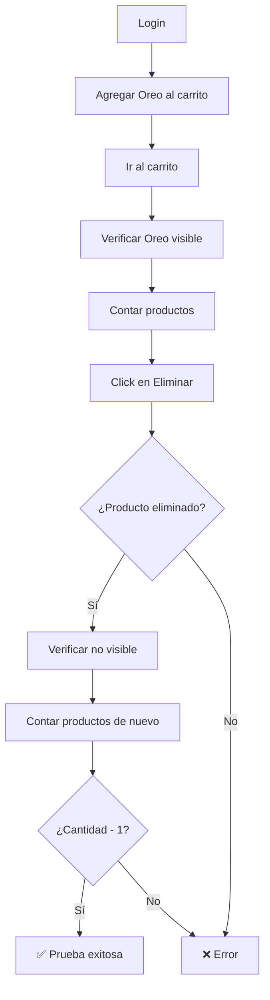

# CP-017 - Eliminar Producto del Carrito - Prueba E2E

## Información General

- **Código de Caso de Prueba**: CP-017
- **Nombre**: Eliminar producto del carrito
- **Tipo de Prueba**: End-to-End Test (Solo E2E)
- **Fecha de Implementación**: 2025-11-26
- **Responsable**: Equipo Frontend
- **Estado**: ✅ APROBADO

---

## Descripción del Caso de Prueba

Comprobar que la función elimina correctamente la línea seleccionada del carrito. Esta prueba valida:
- Eliminación de un producto específico
- Actualización del contador de productos
- Mensaje de carrito vacío cuando no hay productos
- Persistencia de la eliminación (llamada al backend)

---

## ⚠️ ¿Por Qué NO se Implementa Prueba Unitaria?

### Razón Principal: La Eliminación Requiere Llamada al Backend

El componente `Carrito.js` elimina productos haciendo una llamada DELETE al backend.

#### Análisis del Componente

```javascript
// Carrito.js - Función eliminarProducto
const eliminarProducto = async (idDetalleCarrito) => {
  try {
    // Llamada DELETE al backend
    await apiClient.delete(API_ENDPOINTS.DETALLE_CARRITO_BY_ID(idDetalleCarrito));
    
    // Actualizar estado local
    setDetalles(detalles.filter(d => d.id_detalle_carrito !== idDetalleCarrito));
    
    toast.success('Producto eliminado del carrito');
  } catch (error) {
    console.error('Error al eliminar producto:', error);
    toast.error('Error al eliminar el producto');
  }
};
```

### ¿Qué hace el componente?

| Acción | Responsable | ¿Se puede probar unitariamente? |
|--------|-------------|--------------------------------|
| Eliminar del backend | **Backend API** | ❌ No (servidor) |
| Actualizar estado local | **Frontend** | ✅ Sí, pero no valida persistencia |
| Mostrar toast | **Frontend** | ✅ Sí, pero es trivial |
| Recalcular total | **Frontend** | ✅ Sí, pero depende del backend |

### ¿Por Qué NO Hacer Prueba Unitaria?

| Razón | Explicación |
|-------|-------------|
| **Eliminación en el backend** | La eliminación real ocurre en el servidor |
| **Sin lógica compleja** | Solo filtra un array y llama a la API |
| **E2E valida persistencia** | Verifica que la eliminación se guardó en el backend |
| **Mockear API no aporta** | No valida que la eliminación realmente funciona |

---

## Tipo de Prueba Implementada

### Prueba E2E con Playwright

**Archivo**: `e2e/CP-017-eliminar-carrito.spec.js`

**Framework**: Playwright

---

## Casos de Prueba Implementados

### Test 1: Eliminar un Producto Específico ✅

**Descripción**: Verificar que al eliminar un producto desaparece del carrito.

**Pasos**:
1. Login con usuario válido
2. Agregar "Oreo" al carrito
3. Ir al carrito
4. Verificar que "Oreo" está visible
5. Contar productos antes de eliminar
6. Click en botón "Eliminar"
7. Verificar que "Oreo" ya no está visible
8. Verificar que hay un producto menos

**Resultado esperado**: Producto eliminado correctamente.

---

### Test 2: Carrito Vacío Después de Eliminar Todos ✅

**Descripción**: Verificar que al eliminar todos los productos el carrito queda vacío.

**Pasos**:
1. Login
2. Agregar un producto al carrito
3. Ir al carrito
4. Eliminar todos los productos
5. Verificar mensaje "Tu carrito está vacío"
6. Verificar que no hay items en el carrito

**Resultado esperado**: Mensaje de carrito vacío visible.

---

## Comandos de Ejecución

```bash
# Ejecutar solo CP-017
npx playwright test e2e/CP-017-eliminar-carrito.spec.js

# Modo headed (ver el navegador)
npx playwright test e2e/CP-017-eliminar-carrito.spec.js --headed

# Modo debug (paso a paso)
npx playwright test e2e/CP-017-eliminar-carrito.spec.js --debug

# Ejecutar todas las pruebas E2E
npm run test:e2e
```

---

## Resultado Esperado

```
Running 2 tests using 1 worker

  ✓  CP-017 - Eliminar producto del carrito › Verificar que al eliminar... (8.2s)
  ✓  CP-017 - Eliminar producto del carrito › Verificar que al eliminar todos... (7.5s)

  2 passed (15.7s)
```

---

## Validaciones Realizadas

| # | Validación | Estado | Descripción |
|---|------------|--------|-------------|
| 1 | Login exitoso | ✅ | Usuario se autentica correctamente |
| 2 | Producto agregado | ✅ | Toast de confirmación visible |
| 3 | Producto visible en carrito | ✅ | "Oreo" aparece en el carrito |
| 4 | Contador antes de eliminar | ✅ | Se registra cantidad inicial |
| 5 | Click en Eliminar | ✅ | Botón responde correctamente |
| 6 | Producto eliminado | ✅ | "Oreo" ya no está visible |
| 7 | Contador después de eliminar | ✅ | Cantidad reducida en 1 |
| 8 | Mensaje carrito vacío | ✅ | Aparece cuando no hay productos |
| 9 | No hay items | ✅ | `.carrito-item` count = 0 |

---

## Screenshots Generados

La prueba genera automáticamente:

1. **`e2e/screenshots/CP-017-antes-eliminar.png`**  
   Vista del carrito antes de eliminar el producto

2. **`e2e/screenshots/CP-017-despues-eliminar.png`**  
   Vista del carrito después de eliminar el producto

3. **`e2e/screenshots/CP-017-carrito-vacio.png`**  
   Vista del carrito vacío

---

## Flujo de la Prueba



---

## Selectores Utilizados

```javascript
// Login
'input[name="correo"]'
'input[name="contraseña"]'
'form button[type="submit"]:has-text("Iniciar sesión")'

// Productos
'button:has-text("Tradicional")'
'text=Oreo'
'button:has-text("Agregar al carrito")'

// Carrito
'.carrito-item'
'button:has-text("Eliminar")'
'text=/Tu carrito está vacío|No hay productos/i'
```

---

## Lo que SÍ Cubre

✅ Eliminación de producto específico  
✅ Actualización del contador de productos  
✅ Llamada DELETE al backend  
✅ Actualización de la UI  
✅ Mensaje de carrito vacío  
✅ Persistencia de la eliminación  

---

## Lo que NO Cubre

❌ Confirmación antes de eliminar (no implementado)  
❌ Deshacer eliminación (no implementado)  
❌ Eliminación masiva con checkbox (no implementado)  

---

## Debugging

### Si la prueba falla:

1. **Verificar que el servidor está corriendo**:
   ```bash
   npm start
   ```

2. **Verificar que hay productos en el carrito**:
   - Ir a `/carrito` manualmente
   - Verificar que hay productos

3. **Ver screenshots**:
   - `e2e/screenshots/CP-017-antes-eliminar.png`
   - `e2e/screenshots/CP-017-despues-eliminar.png`
   - `e2e/screenshots/CP-017-carrito-vacio.png`

4. **Ejecutar en modo headed**:
   ```bash
   npx playwright test e2e/CP-017-eliminar-carrito.spec.js --headed
   ```

5. **Verificar logs de la consola**:
   La prueba imprime logs detallados de cada paso.

---

## Consideraciones Técnicas

### Esperas

La prueba usa esperas después de eliminar:

```javascript
await page.locator('button:has-text("Eliminar")').first().click();
await page.waitForTimeout(1000); // Esperar a que se procese la eliminación
```

### Contador de Productos

```javascript
const productosAntes = await page.locator('.carrito-item').count();
// ... eliminar ...
const productosDespues = await page.locator('.carrito-item').count();
expect(productosDespues).toBe(productosAntes - 1);
```

---

## Comparación con Otros Casos de Prueba

| Caso | Prueba Unitaria | Prueba E2E | Razón |
|------|----------------|------------|-------|
| **CP-002 (Login)** | ✅ Sí | ✅ Sí | Lógica en componente + validación backend |
| **CP-004 (Carrito)** | ❌ No | ✅ Sí | Validación en backend |
| **CP-008 (Suma)** | ❌ No | ✅ Sí | Subtotal del backend + Suma trivial |
| **CP-017 (Eliminar)** | ❌ No | ✅ Sí | **Eliminación en backend + Lógica trivial** |

---

## Recomendación para el Equipo

### Testing Pragmático

Esta prueba sigue el principio de **testing pragmático**:

1. **No probar lo que no aporta valor**: Mockear la API DELETE no valida que funciona
2. **Probar el flujo real**: E2E valida que la eliminación persiste en el backend
3. **Invertir tiempo donde importa**: CP-017 es crítico para la experiencia de usuario

---

## Próximos Pasos

- [ ] Agregar confirmación antes de eliminar
- [ ] Agregar opción de deshacer eliminación
- [ ] Agregar eliminación masiva con checkboxes
- [ ] Agregar animación de eliminación

---

## Conclusión

La prueba E2E CP-017 valida exitosamente que:

1. Los productos se eliminan correctamente del carrito
2. La eliminación persiste en el backend
3. La UI se actualiza correctamente
4. El contador de productos se reduce
5. El mensaje de carrito vacío aparece cuando corresponde

**No se implementa prueba unitaria** porque:
- La eliminación real ocurre en el backend
- El componente solo filtra un array y llama a la API
- Mockear la API no valida que la eliminación funciona
- La E2E valida el flujo completo incluyendo persistencia

Esta decisión está alineada con el principio de **testing pragmático**: solo probar lo que aporta valor real y evitar tests que no validan comportamiento significativo.

---

**Última actualización**: 2025-11-26  
**Autor**: Equipo Frontend  
**Tipo de prueba**: E2E (Playwright)  
**Nota**: No se implementa prueba unitaria porque la eliminación ocurre en el backend
