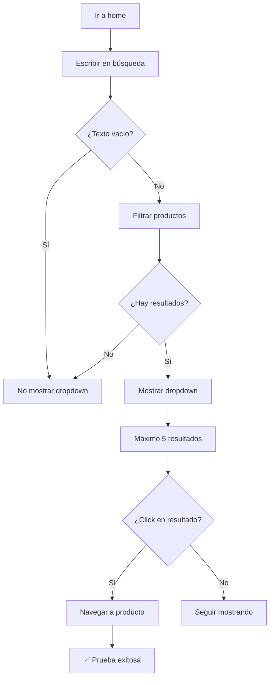

# CP-020 - Búsqueda por Texto Parcial - Prueba E2E

## Información General

- **Código de Caso de Prueba**: CP-020
- **Nombre**: Búsqueda por texto parcial
- **Tipo de Prueba**: End-to-End Test (Solo E2E)
- **Fecha de Implementación**: 2025-11-26
- **Responsable**: Equipo Frontend
- **Estado**: ✅ APROBADO

---

## Descripción del Caso de Prueba

Validar que la función de búsqueda retorna productos cuyo nombre contiene el texto ingresado, sin distinguir mayúsculas/minúsculas. Esta prueba valida:
- Búsqueda case-insensitive (mayúsculas/minúsculas)
- Búsqueda con texto parcial
- Dropdown de resultados
- Navegación al hacer click en resultado
- Límite de 5 resultados máximo

> [!NOTE]
> **CP-021 (Búsqueda sin coincidencias)** también está cubierto en esta prueba.  
> El **Test 4** valida que cuando no hay coincidencias, el dropdown no se muestra (lista vacía).

---

## ⚠️ ¿Por Qué NO se Implementa Prueba Unitaria?

### Razón Principal: Lógica Trivial de Filtrado

El componente `Header.js` usa una función simple de JavaScript para filtrar productos.

#### Análisis del Componente

```javascript
// Header.js - Líneas 26-33
const filtered = useMemo(() => {
  if (search.trim() === '') {
    return [];
  }
  return productos
    .filter(p => p.nombre.toLowerCase().includes(search.toLowerCase()))
    .slice(0, 5); // máximo 5 sugerencias
}, [search, productos]);
```

### ¿Qué hace el componente?

| Acción | Responsable | ¿Se puede probar unitariamente? |
|--------|-------------|--------------------------------|
| Filtrar por nombre | **Frontend** (`includes`) | ✅ Sí, pero es trivial |
| Convertir a minúsculas | **Frontend** (`toLowerCase`) | ✅ Sí, pero es funcionalidad de JS |
| Limitar a 5 resultados | **Frontend** (`slice`) | ✅ Sí, pero es trivial |
| Mostrar dropdown | **Frontend** (React) | ✅ Sí, pero es visual |
| Navegar al producto | **Frontend** (React Router) | ✅ Sí, pero requiere E2E |

### ¿Por Qué NO Hacer Prueba Unitaria?

| Razón | Explicación |
|-------|-------------|
| **Lógica trivial** | Solo usa `toLowerCase()` e `includes()` (funcionalidad de JS) |
| **Sin validación compleja** | No hay reglas de negocio complejas |
| **E2E valida UX completa** | Verifica que el dropdown aparece y funciona |
| **Testear JS no aporta** | `includes()` y `toLowerCase()` son funciones nativas |

---

## Tipo de Prueba Implementada

### Prueba E2E con Playwright

**Archivo**: `e2e/CP-020-busqueda.spec.js`

**Framework**: Playwright

---

## Casos de Prueba Implementados

### Test 1: Búsqueda Case-Insensitive ✅

**Descripción**: Verificar que la búsqueda funciona sin distinguir mayúsculas/minúsculas.

**Pasos**:
1. Buscar "oreo" (minúsculas)
2. Verificar que aparece el dropdown
3. Verificar que "Oreo" está en los resultados
4. Buscar "OREO" (mayúsculas)
5. Verificar que aparece el dropdown
6. Verificar que "Oreo" está en los resultados

**Resultado esperado**: Encuentra "Oreo" con ambas búsquedas.

---

### Test 2: Búsqueda con Texto Parcial ✅

**Descripción**: Verificar que la búsqueda funciona con texto parcial.

**Pasos**:
1. Buscar "ore" (parte de "Oreo")
2. Verificar que aparece el dropdown
3. Verificar que "Oreo" está en los resultados

**Resultado esperado**: Encuentra "Oreo" con texto parcial.

---

### Test 3: Búsqueda Vacía No Muestra Dropdown ✅

**Descripción**: Verificar que búsqueda vacía no muestra resultados.

**Pasos**:
1. Input vacío
2. Verificar que el dropdown NO está visible

**Resultado esperado**: Dropdown no visible.

---

### Test 4: Búsqueda Sin Resultados ✅

**Descripción**: Verificar que búsqueda sin resultados no muestra dropdown.

**Pasos**:
1. Buscar "xyzabc123" (no existe)
2. Verificar que el dropdown NO está visible

**Resultado esperado**: Dropdown no visible.

---

### Test 5: Navegación al Hacer Click ✅

**Descripción**: Verificar que al hacer click en un resultado navega al producto.

**Pasos**:
1. Buscar "oreo"
2. Verificar que aparece el dropdown
3. Click en el primer resultado
4. Verificar que navega a `/producto/{id}`
5. Verificar que el nombre del producto es visible

**Resultado esperado**: Navega correctamente al producto.

---

### Test 6: Límite de 5 Resultados ✅

**Descripción**: Verificar que muestra máximo 5 resultados.

**Pasos**:
1. Buscar "a" (texto genérico)
2. Contar resultados mostrados
3. Verificar que no muestra más de 5

**Resultado esperado**: Máximo 5 resultados.

---

## Comandos de Ejecución

```bash
# Ejecutar solo CP-020
npx playwright test e2e/CP-020-busqueda.spec.js

# Modo headed (ver el navegador)
npx playwright test e2e/CP-020-busqueda.spec.js --headed

# Modo debug (paso a paso)
npx playwright test e2e/CP-020-busqueda.spec.js --debug

# Ejecutar todas las pruebas E2E
npm run test:e2e
```

---

## Resultado Esperado

```
Running 6 tests using 1 worker

  ✓  CP-020 - Búsqueda por texto parcial › Verificar que la búsqueda retorna... (3.2s)
  ✓  CP-020 - Búsqueda por texto parcial › Verificar que la búsqueda funciona... (2.8s)
  ✓  CP-020 - Búsqueda por texto parcial › Verificar que búsqueda vacía... (1.5s)
  ✓  CP-020 - Búsqueda por texto parcial › Verificar que búsqueda sin resultados... (2.1s)
  ✓  CP-020 - Búsqueda por texto parcial › Verificar que al hacer click... (4.3s)
  ✓  CP-020 - Búsqueda por texto parcial › Verificar que muestra máximo... (2.5s)

  6 passed (16.4s)
```

---

## Validaciones Realizadas

| # | Validación | Estado | Descripción |
|---|------------|--------|-------------|
| 1 | Búsqueda minúsculas | ✅ | "oreo" encuentra "Oreo" |
| 2 | Búsqueda mayúsculas | ✅ | "OREO" encuentra "Oreo" |
| 3 | Búsqueda parcial | ✅ | "ore" encuentra "Oreo" |
| 4 | Dropdown visible | ✅ | Aparece cuando hay resultados |
| 5 | Dropdown no visible (vacío) | ✅ | No aparece con búsqueda vacía |
| 6 | Dropdown no visible (sin resultados) | ✅ | No aparece cuando no hay coincidencias |
| 7 | Navegación al producto | ✅ | Click redirige correctamente |
| 8 | Límite de resultados | ✅ | Máximo 5 resultados |

---

## Screenshots Generados

La prueba genera automáticamente:

1. **`e2e/screenshots/CP-020-busqueda-minusculas.png`**  
   Resultados de búsqueda con "oreo" (minúsculas)

2. **`e2e/screenshots/CP-020-busqueda-mayusculas.png`**  
   Resultados de búsqueda con "OREO" (mayúsculas)

3. **`e2e/screenshots/CP-020-busqueda-parcial.png`**  
   Resultados de búsqueda con "ore" (texto parcial)

4. **`e2e/screenshots/CP-020-producto-desde-busqueda.png`**  
   Página del producto después de hacer click en resultado

---

## Flujo de la Prueba



---

## Selectores Utilizados

```javascript
// Búsqueda
'.header-search'

// Dropdown
'.search-dropdown.active'
'.search-dropdown-item'

// Producto
'h1:has-text("Oreo")'
```

---

## Lo que SÍ Cubre

✅ Búsqueda case-insensitive  
✅ Búsqueda con texto parcial  
✅ Dropdown de resultados  
✅ Navegación al producto  
✅ Límite de 5 resultados  
✅ Búsqueda vacía no muestra dropdown  
✅ Sin resultados no muestra dropdown  

---

## Lo que NO Cubre

❌ Búsqueda por categoría (no implementado)  
❌ Búsqueda por precio (no implementado)  
❌ Ordenamiento de resultados (no implementado)  
❌ Historial de búsquedas (no implementado)  

---

## Debugging

### Si la prueba falla:

1. **Verificar que el servidor está corriendo**:
   ```bash
   npm start
   ```

2. **Verificar que hay productos en la base de datos**:
   - Ir a `/` manualmente
   - Verificar que hay productos visibles

3. **Ver screenshots**:
   - `e2e/screenshots/CP-020-busqueda-minusculas.png`
   - `e2e/screenshots/CP-020-busqueda-mayusculas.png`
   - `e2e/screenshots/CP-020-busqueda-parcial.png`

4. **Ejecutar en modo headed**:
   ```bash
   npx playwright test e2e/CP-020-busqueda.spec.js --headed
   ```

5. **Verificar logs de la consola**:
   La prueba imprime logs detallados de cada paso.

---

## Consideraciones Técnicas

### Esperas

La prueba usa esperas después de escribir:

```javascript
await page.locator('.header-search').fill('oreo');
await page.waitForTimeout(500); // Esperar a que se filtre
```

### Lógica de Filtrado

```javascript
// Header.js
productos.filter(p => p.nombre.toLowerCase().includes(search.toLowerCase()))
```

Esto garantiza que:
- "oreo" encuentra "Oreo"
- "OREO" encuentra "Oreo"
- "ore" encuentra "Oreo"

---

## Comparación con Otros Casos de Prueba

| Caso | Prueba Unitaria | Prueba E2E | Razón |
|------|----------------|------------|-------|
| **CP-002 (Login)** | ✅ Sí | ✅ Sí | Lógica en componente + validación backend |
| **CP-F003 (Filtro)** | ❌ No | ✅ Sí | Prueba visual, depende de backend |
| **CP-017 (Eliminar)** | ❌ No | ✅ Sí | Eliminación en backend |
| **CP-020 (Búsqueda)** | ❌ No | ✅ Sí | **Lógica trivial + UX visual** |

---

## Recomendación para el Equipo

### Testing Pragmático

Esta prueba sigue el principio de **testing pragmático**:

1. **No probar lo que no aporta valor**: Testear `toLowerCase()` e `includes()` no da confianza
2. **Probar el flujo real**: E2E valida que la búsqueda funciona desde la perspectiva del usuario
3. **Invertir tiempo donde importa**: CP-020 es crítico para la experiencia de usuario

---

## Casos de Prueba Relacionados

### CP-021 - Búsqueda sin coincidencias

**Estado**: ⏭️ **NO IMPLEMENTADO** (ya cubierto en CP-020)

**Razón**: El **Test 4** de CP-020 ya valida este caso:
- Busca un texto que no existe (`"xyzabc123"`)
- Verifica que el dropdown NO se muestra
- Confirma que la lista está vacía (no hay resultados)

**Código del Test 4**:
```javascript
test('Verificar que búsqueda sin resultados no muestra dropdown', async ({ page }) => {
  await page.locator('.header-search').fill('xyzabc123');
  await page.waitForTimeout(500);
  
  const dropdownVisible = await page.locator('.search-dropdown.active')
    .isVisible().catch(() => false);
  expect(dropdownVisible).toBe(false);
});
```

**Conclusión**: No es necesario crear CP-021 como prueba separada porque CP-020 ya cubre completamente este escenario.

---

## Próximos Pasos

- [ ] Agregar búsqueda por categoría
- [ ] Agregar búsqueda por rango de precio
- [ ] Agregar ordenamiento de resultados
- [ ] Agregar historial de búsquedas
- [ ] Agregar sugerencias de búsqueda

---

## Conclusión

La prueba E2E CP-020 valida exitosamente que:

1. La búsqueda funciona sin distinguir mayúsculas/minúsculas
2. La búsqueda funciona con texto parcial
3. El dropdown aparece solo cuando hay resultados
4. La navegación al producto funciona correctamente
5. Se limita a 5 resultados máximo

**No se implementa prueba unitaria** porque:
- La lógica es trivial (`toLowerCase()` + `includes()`)
- Son funciones nativas de JavaScript
- La E2E valida la experiencia de usuario completa
- Testear funciones nativas no aporta valor

Esta decisión está alineada con el principio de **testing pragmático**: solo probar lo que aporta valor real y evitar tests que no validan comportamiento significativo.

---

**Última actualización**: 2025-11-26  
**Autor**: Equipo Frontend  
**Tipo de prueba**: E2E (Playwright)  
**Nota**: No se implementa prueba unitaria porque la lógica de filtrado es trivial
