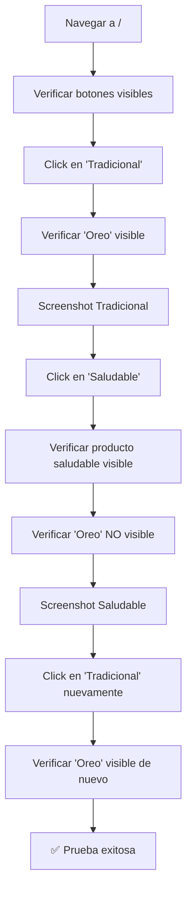

# CP-F003 - Filtro de Productos por Categoría - Documentación de Prueba

## Información General

- **Código de Caso de Prueba**: CP-F003
- **Nombre**: Filtro de productos por categoría
- **Fecha de Implementación**: 2025-11-26
- **Responsable**: Equipo Frontend
- **Estado**: ✅ APROBADO

---

## Descripción del Caso de Prueba

Validar que el usuario puede filtrar productos por las categorías "tradicional" y "saludable" usando los botones del header, y que se muestran los productos correctos según la categoría seleccionada.

---

## Tipo de Prueba Implementada

### Prueba E2E (End-to-End) con Playwright

**Archivo**: `e2e/CP-F003-filter.spec.js`

**¿Por qué solo E2E y no prueba unitaria?**

1. **Es una prueba visual**: Necesitamos verificar que los productos correctos aparecen en pantalla
2. **Depende del backend**: Los productos vienen de la API real con `id_categoria`
3. **Interacción simple**: Click → Verificar productos visibles
4. **Mayor valor**: Prueba la integración completa frontend-backend

---

## Qué Valida la Prueba

### Test 1: Filtro Bidireccional

✅ **Navegación** a la página principal  
✅ **Visibilidad** de botones "Tradicional" y "Saludable"  
✅ **Click en "Tradicional"** muestra productos tradicionales  
✅ **Producto específico** "Oreo" está visible  
✅ **Click en "Saludable"** muestra productos saludables  
✅ **Producto específico** "Galleta saludable con harina de almendras y coco" está visible  
✅ **Producto tradicional** ya no está visible (filtro funcionó)  
✅ **Volver a "Tradicional"** muestra nuevamente productos tradicionales  
✅ **Capturas de pantalla** de ambas categorías  

### Test 2: Verificación de Diferencias

✅ **Ambas categorías** tienen productos  
✅ **Conteo de productos** en cada categoría  
✅ **Confirmación** de que las categorías son diferentes  

---

## Comandos de Ejecución

```bash
# Ejecutar solo CP-F003
npx playwright test e2e/CP-F003-filter.spec.js

# Modo headed (ver el navegador)
npx playwright test e2e/CP-F003-filter.spec.js --headed

# Modo debug
npx playwright test e2e/CP-F003-filter.spec.js --debug

# Ejecutar todas las pruebas E2E
npm run test:e2e
```

---

## Resultado Esperado

```
Running 2 tests using 1 worker

  ✓  CP-F003 - Filtro de productos por categoría › Validar que el usuario puede filtrar... (6.5s)
  ✓  CP-F003 - Filtro de productos por categoría › Verificar que ambas categorías... (4.2s)

  2 passed (10.7s)
```

---

## Productos de Referencia

| Categoría | Producto de Prueba |
|-----------|-------------------|
| **Tradicional** | Oreo |
| **Saludable** | Galleta saludable con harina de almendras y coco |

Estos productos se usan para verificar que el filtro funciona correctamente.

---

## Screenshots Generados

La prueba genera automáticamente:

1. **`e2e/screenshots/CP-F003-tradicional.png`**  
   Vista de productos tradicionales

2. **`e2e/screenshots/CP-F003-saludable.png`**  
   Vista de productos saludables

---

## Flujo de la Prueba



---

## Validaciones Realizadas

| # | Validación | Estado | Descripción |
|---|------------|--------|-------------|
| 1 | Página principal carga | ✅ | La home se carga correctamente |
| 2 | Botones de filtro visibles | ✅ | "Tradicional" y "Saludable" están en el header |
| 3 | Click en "Tradicional" | ✅ | El botón responde al click |
| 4 | Producto tradicional visible | ✅ | "Oreo" aparece en la lista |
| 5 | Click en "Saludable" | ✅ | El botón responde al click |
| 6 | Producto saludable visible | ✅ | Producto saludable aparece |
| 7 | Producto tradicional oculto | ✅ | "Oreo" ya no está visible |
| 8 | Filtro bidireccional | ✅ | Volver a "Tradicional" funciona |
| 9 | Ambas categorías tienen productos | ✅ | No hay categorías vacías |

---

## Consideraciones Técnicas

### No Requiere Autenticación

Esta prueba **NO requiere** que el usuario esté autenticado. Los filtros de categoría funcionan para todos los visitantes.

### Selectores Utilizados

```javascript
// Botones de filtro
'button:has-text("Tradicional"), a:has-text("Tradicional")'
'button:has-text("Saludable"), a:has-text("Saludable")'

// Productos específicos
'text=Oreo'
'text=Galleta saludable con harina de almendras y coco'

// Conteo de productos
'[class*="product"], [class*="card"]'
```

---

## Debugging

### Si la prueba falla:

1. **Verificar que el servidor está corriendo**:
   ```bash
   npm start
   ```

2. **Ver screenshots**:
   - `e2e/screenshots/CP-F003-tradicional.png`
   - `e2e/screenshots/CP-F003-saludable.png`

3. **Ejecutar en modo headed**:
   ```bash
   npx playwright test e2e/CP-F003-filter.spec.js --headed
   ```

4. **Verificar que los productos existen en la BD**:
   - Producto "Oreo" debe existir con categoría "tradicional"
   - Producto saludable debe existir con categoría "saludable"

---

## Limitaciones

### Lo que SÍ cubre:

✅ Funcionalidad del filtro en el frontend  
✅ Interacción con botones del header  
✅ Visualización correcta de productos  
✅ Cambio entre categorías  
✅ Integración frontend-backend  

### Lo que NO cubre:

❌ Validación de `id_categoria` en la base de datos  
❌ Lógica del backend para filtrar productos  
❌ Performance con muchos productos  
❌ Filtros combinados (si los hubiera)  

---

## Comparación con CP-002

| Aspecto | CP-002 (Login) | CP-F003 (Filtro) |
|---------|----------------|------------------|
| **Prueba Unitaria** | ✅ Sí | ❌ No |
| **Prueba E2E** | ✅ Sí | ✅ Sí |
| **Requiere autenticación** | ✅ Sí | ❌ No |
| **Interacción con backend** | ✅ Sí | ✅ Sí |
| **Validación visual** | Parcial | ✅ Total |

**Razón**: CP-F003 es principalmente una prueba visual, por lo que solo tiene sentido hacerla E2E.

---

## Próximos Pasos

- [ ] Agregar prueba para CP-004 (Añadir producto al carrito)
- [ ] Verificar comportamiento con categorías vacías
- [ ] Agregar prueba de performance (tiempo de carga al filtrar)

---

## Conclusión

La prueba CP-F003 valida exitosamente que:

1. Los botones de filtro "Tradicional" y "Saludable" funcionan correctamente
2. Los productos se filtran según la categoría seleccionada
3. El filtro es bidireccional (se puede cambiar entre categorías)
4. Ambas categorías tienen productos disponibles

Esta prueba E2E proporciona confianza en que el sistema de filtrado funciona correctamente en un entorno real.

---

**Última actualización**: 2025-11-26  
**Autor**: Equipo Frontend  
**Tipo de prueba**: E2E (Playwright)
