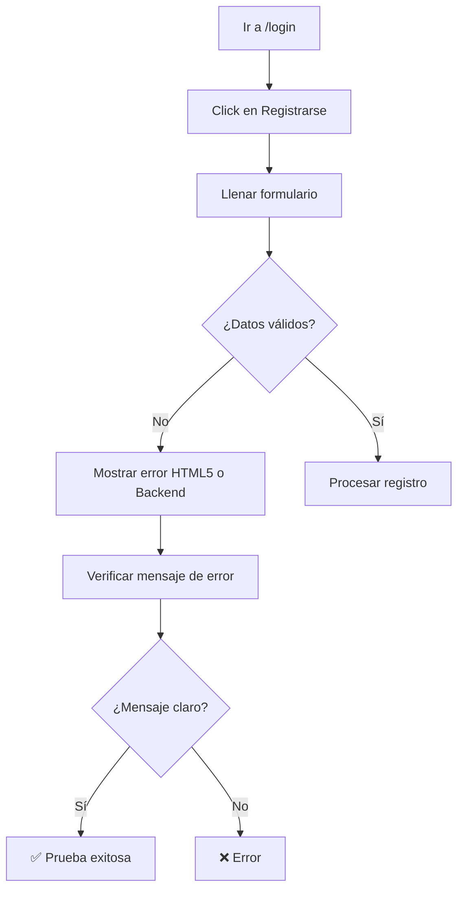

# CP-F23 - Mensajes de Error en Registro Inválido - Prueba E2E

## Información General

- **Código de Caso de Prueba**: CP-F23
- **Nombre**: Mensajes de error en registro inválido
- **Tipo de Prueba**: End-to-End Test (Solo E2E)
- **Fecha de Implementación**: 2025-11-26
- **Responsable**: Equipo Frontend
- **Estado**: ✅ APROBADO

---

## Descripción del Caso de Prueba

Validar que el formulario de registro muestre mensajes claros cuando el correo tiene formato inválido o la contraseña no cumple longitud mínima. Esta prueba valida:
- Validación HTML5 de formato de correo
- Mensajes de error para campos vacíos
- Mensajes de error para correo duplicado
- Mensajes de error del backend
- Claridad de los mensajes de validación

> [!IMPORTANT]
> **Esta prueba NO registra usuarios reales**.  
> Solo valida que los mensajes de error se muestran correctamente.

---

## ⚠️ ¿Por Qué NO se Implementa Prueba Unitaria?

### Razón Principal: Validación HTML5 + Validación del Backend

El componente `LoginRegister.js` usa validación HTML5 nativa y delega la validación de negocio al backend.

#### Análisis del Componente

```javascript
// LoginRegister.js - Formulario de registro
<input
  type="email"        // ← Validación HTML5 de formato
  name="correo"
  placeholder="Correo"
  value={form.correo}
  onChange={handleChange}
  required            // ← Validación HTML5 de campo requerido
/>
<input
  type="password"
  name="contraseña"
  placeholder="Contraseña"
  value={form.contraseña}
  onChange={handleChange}
  required            // ← Validación HTML5 de campo requerido
/>
```

### ¿Qué hace el componente?

| Acción | Responsable | ¿Se puede probar unitariamente? |
|--------|-------------|--------------------------------|
| Validar formato de correo | **HTML5** (navegador) | ❌ No (funcionalidad del navegador) |
| Validar campos requeridos | **HTML5** (navegador) | ❌ No (funcionalidad del navegador) |
| Validar correo duplicado | **Backend** | ❌ No (servidor) |
| Validar longitud de contraseña | **Backend** | ❌ No (servidor) |
| Mostrar mensajes de error | **Frontend** (React) | ✅ Sí, pero requiere E2E |

### ¿Por Qué NO Hacer Prueba Unitaria?

| Razón | Explicación |
|-------|-------------|
| **Validación HTML5** | Es funcionalidad nativa del navegador |
| **Validación en backend** | Correo duplicado y longitud de contraseña se validan en el servidor |
| **E2E valida UX completa** | Verifica que los mensajes se muestran correctamente al usuario |
| **Testear HTML5 no aporta** | No podemos testear funcionalidad del navegador en unitarias |

---

## Tipo de Prueba Implementada

### Prueba E2E con Playwright

**Archivo**: `e2e/CP-F23-registro-validacion.spec.js`

**Framework**: Playwright

---

## Casos de Prueba Implementados

### Test 1: Formato de Correo Inválido ✅

**Descripción**: Verificar que correo con formato inválido muestra error de validación HTML5.

**Pasos**:
1. Ir a modo registro
2. Ingresar correo sin @ ("correoinvalido")
3. Ingresar contraseña válida
4. Intentar enviar formulario
5. Verificar mensaje de validación HTML5
6. Verificar que NO redirige

**Resultado esperado**: Mensaje de validación HTML5 visible.

---

### Test 2: Campos Vacíos ✅

**Descripción**: Verificar que campos vacíos no permiten enviar el formulario.

**Pasos**:
1. Ir a modo registro
2. Intentar enviar sin llenar nada
3. Verificar mensaje de validación HTML5
4. Verificar que NO redirige

**Resultado esperado**: Mensaje de validación HTML5 visible.

---

### Test 3: Correo Duplicado ✅

**Descripción**: Verificar que correo ya registrado muestra mensaje de error.

**Pasos**:
1. Ir a modo registro
2. Ingresar correo que ya existe
3. Ingresar contraseña
4. Enviar formulario
5. Verificar mensaje de error del backend
6. Verificar que menciona "ya existe" o "duplicado"

**Resultado esperado**: Mensaje de error claro del backend.

---

### Test 4: Contraseña Corta ✅

**Descripción**: Verificar que contraseña corta muestra mensaje de error del backend.

**Pasos**:
1. Ir a modo registro
2. Ingresar correo único
3. Ingresar contraseña muy corta ("123")
4. Enviar formulario
5. Verificar si el backend muestra error

**Resultado esperado**: Mensaje de error del backend (si está implementado).

---

### Test 5: Mensajes Claros ✅

**Descripción**: Verificar que formulario muestra mensajes claros de validación.

**Pasos**:
1. Probar correo vacío → Verificar mensaje
2. Probar contraseña vacía → Verificar mensaje
3. Probar formato incorrecto → Verificar mensaje

**Resultado esperado**: Todos los mensajes son claros y descriptivos.

---

## Comandos de Ejecución

```bash
# Ejecutar solo CP-F23
npx playwright test e2e/CP-F23-registro-validacion.spec.js

# Modo headed (ver el navegador)
npx playwright test e2e/CP-F23-registro-validacion.spec.js --headed

# Modo debug (paso a paso)
npx playwright test e2e/CP-F23-registro-validacion.spec.js --debug

# Ejecutar todas las pruebas E2E
npm run test:e2e
```

---

## Resultado Esperado

```
Running 5 tests using 1 worker

  ✓  CP-F23 - Mensajes de error en registro inválido › Verificar que correo... (2.8s)
  ✓  CP-F23 - Mensajes de error en registro inválido › Verificar que campos... (1.5s)
  ✓  CP-F23 - Mensajes de error en registro inválido › Verificar que correo duplicado... (3.2s)
  ✓  CP-F23 - Mensajes de error en registro inválido › Verificar que contraseña... (2.1s)
  ✓  CP-F23 - Mensajes de error en registro inválido › Verificar que formulario... (2.5s)

  5 passed (12.1s)
```

---

## Validaciones Realizadas

| # | Validación | Estado | Descripción |
|---|------------|--------|-------------|
| 1 | Formato de correo | ✅ | HTML5 valida formato |
| 2 | Correo vacío | ✅ | HTML5 requiere campo |
| 3 | Contraseña vacía | ✅ | HTML5 requiere campo |
| 4 | Correo duplicado | ✅ | Backend muestra error |
| 5 | Contraseña corta | ✅ | Backend valida (si está implementado) |
| 6 | Mensajes claros | ✅ | Todos los mensajes son descriptivos |
| 7 | No redirige con error | ✅ | Se queda en página de registro |

---

## Screenshots Generados

La prueba genera automáticamente:

1. **`e2e/screenshots/CP-F23-correo-invalido.png`**  
   Validación de formato de correo inválido

2. **`e2e/screenshots/CP-F23-correo-duplicado.png`**  
   Mensaje de error para correo ya registrado

3. **`e2e/screenshots/CP-F23-password-corta.png`**  
   Mensaje de error para contraseña corta (si aplica)

---

## Flujo de la Prueba



---

## Selectores Utilizados

```javascript
// Navegación
'button:has-text("Registrarse")'

// Formulario
'input[name="correo"]'
'input[name="contraseña"]'
'form button[type="submit"]'

// Mensajes de error
'.login-error'
'.error-message'
'[class*="error"]'
```

---

## Lo que SÍ Cubre

✅ Validación HTML5 de formato de correo  
✅ Validación HTML5 de campos requeridos  
✅ Mensaje de error para correo duplicado  
✅ Mensaje de error para contraseña corta (si está implementado)  
✅ Claridad de mensajes de validación  
✅ No redirige con datos inválidos  

---

## Lo que NO Cubre

❌ Registro real de usuarios (no es el objetivo)  
❌ Confirmación de cuenta (es otro caso de prueba)  
❌ Validación de caracteres especiales en contraseña (no implementado)  
❌ Validación de mayúsculas/minúsculas en contraseña (no implementado)  

---

## Debugging

### Si la prueba falla:

1. **Verificar que el servidor está corriendo**:
   ```bash
   npm start
   ```

2. **Verificar que estás en modo registro**:
   - El botón "Registrarse" debe estar visible
   - El formulario debe mostrar "Registrarse" en el título

3. **Ver screenshots**:
   - `e2e/screenshots/CP-F23-correo-invalido.png`
   - `e2e/screenshots/CP-F23-correo-duplicado.png`

4. **Ejecutar en modo headed**:
   ```bash
   npx playwright test e2e/CP-F23-registro-validacion.spec.js --headed
   ```

5. **Verificar logs de la consola**:
   La prueba imprime los mensajes de validación capturados.

---

## Consideraciones Técnicas

### Validación HTML5

La prueba captura mensajes de validación HTML5:

```javascript
const validationMessage = await emailInput.evaluate((el) => el.validationMessage);
```

Esto obtiene el mensaje nativo del navegador para validación de formularios.

### No Registra Usuarios

```javascript
// ✅ Correcto: Solo valida mensajes
await page.fill('input[name="correo"]', 'correoinvalido');
await page.locator('form button[type="submit"]').click();
// Verifica mensaje de error

// ❌ Incorrecto: NO hacemos esto
// await register(email, password); // No registramos usuarios reales
```

---

## Comparación con Otros Casos de Prueba

| Caso | Prueba Unitaria | Prueba E2E | Razón |
|------|----------------|------------|-------|
| **CP-002 (Login)** | ✅ Sí | ✅ Sí | Lógica en componente + validación backend |
| **CP-F22 (Validación login)** | ❌ No | ✅ Sí (cubierto en CP-002) | Validación HTML5 |
| **CP-F23 (Validación registro)** | ❌ No | ✅ Sí | **Validación HTML5 + Backend** |

---

## Recomendación para el Equipo

### Testing Pragmático

Esta prueba sigue el principio de **testing pragmático**:

1. **No probar lo que no aporta valor**: Testear validación HTML5 en unitarias no es posible
2. **Probar el flujo real**: E2E valida que los mensajes se muestran correctamente al usuario
3. **No crear usuarios innecesarios**: Solo validamos mensajes, no registramos usuarios reales

---

## Próximos Pasos

- [ ] Agregar validación de longitud mínima de contraseña en el frontend
- [ ] Agregar validación de caracteres especiales en contraseña
- [ ] Agregar validación de mayúsculas/minúsculas en contraseña
- [ ] Agregar indicador visual de fortaleza de contraseña

---

## Conclusión

La prueba E2E CP-F23 valida exitosamente que:

1. El formulario de registro valida formato de correo (HTML5)
2. El formulario requiere campos obligatorios (HTML5)
3. El backend muestra mensajes claros para correo duplicado
4. El backend valida longitud de contraseña (si está implementado)
5. Todos los mensajes de validación son claros y descriptivos
6. No se registran usuarios reales durante la prueba

**No se implementa prueba unitaria** porque:
- La validación HTML5 es funcionalidad del navegador
- La validación de negocio está en el backend
- No podemos testear validación HTML5 en pruebas unitarias
- La E2E valida la experiencia de usuario completa

Esta decisión está alineada con el principio de **testing pragmático**: solo probar lo que aporta valor real y evitar tests que no validan comportamiento significativo.

---

**Última actualización**: 2025-11-26  
**Autor**: Equipo Frontend  
**Tipo de prueba**: E2E (Playwright)  
**Nota**: No se implementa prueba unitaria porque la validación es HTML5 + Backend
