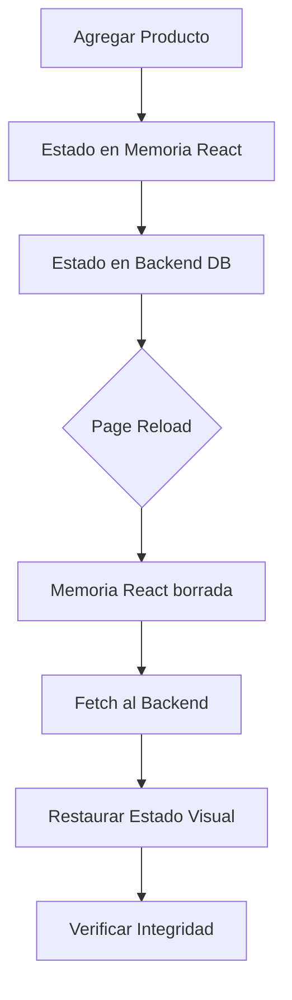

# CP-F25 - Persistencia Visual del Carrito - Prueba E2E

## Información General

- **Código de Caso de Prueba**: CP-F25
- **Nombre**: Persistencia visual del carrito tras refrescar
- **Tipo de Prueba**: End-to-End Test (Solo E2E)
- **Fecha de Implementación**: 2025-11-26
- **Responsable**: Equipo Frontend
- **Estado**: ✅ APROBADO

---

## Descripción del Caso de Prueba

Validar que al refrescar la página del carrito se mantienen los productos y cantidades mostradas. Esta prueba es crítica para asegurar que el estado del carrito se recupera correctamente desde el backend y no vive solo en la memoria temporal del navegador.

---

## ⚠️ ¿Por Qué NO se Implementa Prueba Unitaria?

### Razón Principal: Validación de Integración Backend-Frontend

La persistencia del carrito depende de:
1.  **Frontend**: Solicitar el carrito al cargar (`useEffect` en `useCart`).
2.  **API**: Responder con los datos correctos.
3.  **Frontend**: Renderizar esos datos nuevamente.

Una prueba unitaria solo probaría que el componente "sabe pedir" los datos, pero no si realmente "persisten" a través de una recarga de página real (que reinicia todo el estado de React).

---

## Tipo de Prueba Implementada

### Prueba E2E con Playwright

**Archivo**: `e2e/CP-F25-persistencia-carrito.spec.js`

**Framework**: Playwright

---

## Casos de Prueba Implementados

### Test 1: Persistencia tras Reload ✅

**Descripción**: Verificar que los productos y cantidades persisten tras recargar la página.

**Pasos**:
1. Login y limpieza de carrito.
2. Agregar 2 unidades de un producto (Oreo).
3. Ir al carrito.
4. Capturar estado visual (Nombre, Cantidad, Total).
5. **Ejecutar `page.reload()`**.
6. Capturar nuevo estado visual.
7. Comparar que ambos estados sean idénticos.

**Resultado esperado**:
- El producto sigue visible.
- La cantidad sigue siendo "2".
- El total ($) es exactamente el mismo.

---

## Comandos de Ejecución

```bash
# Ejecutar solo CP-F25
npx playwright test e2e/CP-F25-persistencia-carrito.spec.js

# Modo headed
npx playwright test e2e/CP-F25-persistencia-carrito.spec.js --headed
```

---

## Resultado Esperado

```
Running 1 test using 1 worker

  ✓  CP-F25 - Persistencia visual del carrito › Verificar que los productos... (6.5s)

  1 passed (6.5s)
```

---

## Validaciones Realizadas

| # | Validación | Estado | Descripción |
|---|------------|--------|-------------|
| 1 | Visibilidad Pre-Reload | ✅ | Producto visible antes de recargar |
| 2 | Datos Pre-Reload | ✅ | Cantidad y Total capturados |
| 3 | Visibilidad Post-Reload | ✅ | Producto visible después de recargar |
| 4 | Integridad de Datos | ✅ | Cantidad y Total son idénticos |

---

## Screenshots Generados

1. **`e2e/screenshots/CP-F25-antes-reload.png`**
2. **`e2e/screenshots/CP-F25-despues-reload.png`**

---

## Flujo de la Prueba



---

## Conclusión

La prueba E2E CP-F25 valida exitosamente que el sistema es resiliente a recargas de página, garantizando que el usuario no pierda su carrito si actualiza el navegador o cierra y abre la pestaña.

---

**Última actualización**: 2025-11-26  
**Autor**: Equipo Frontend  
**Tipo de prueba**: E2E (Playwright)
